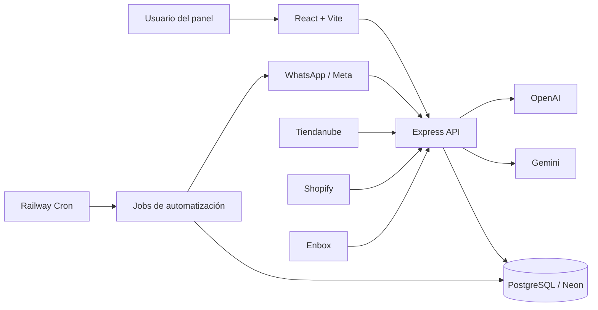
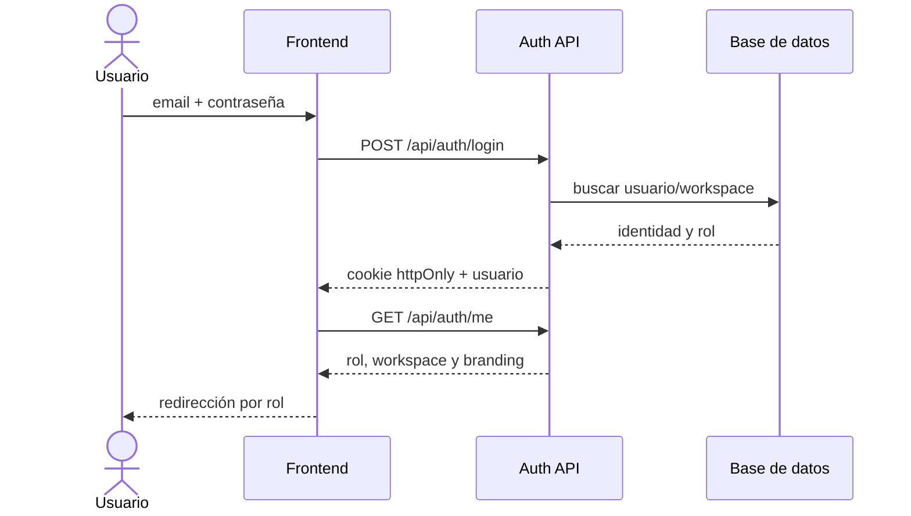
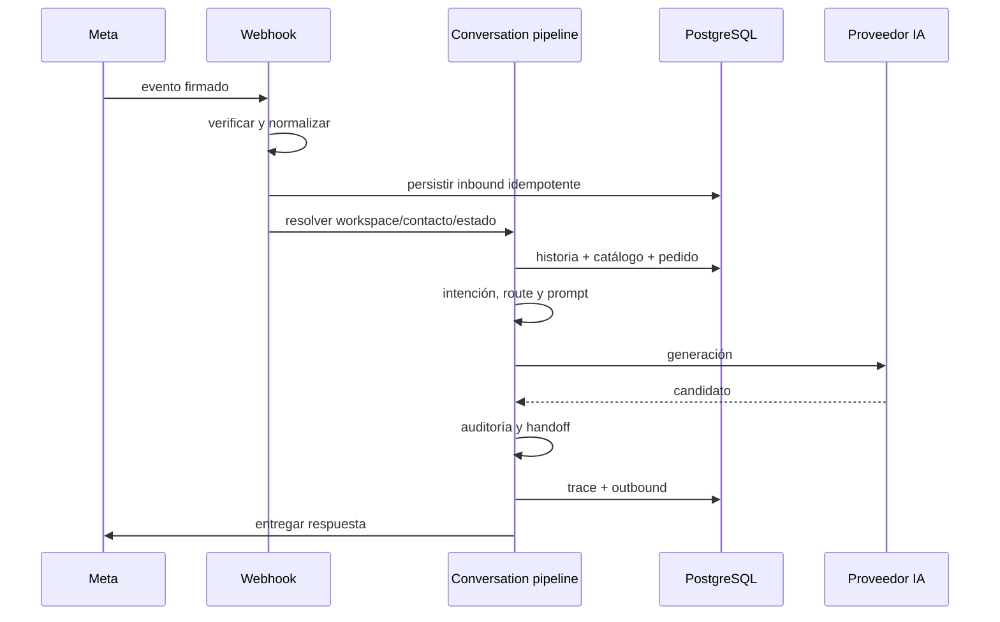
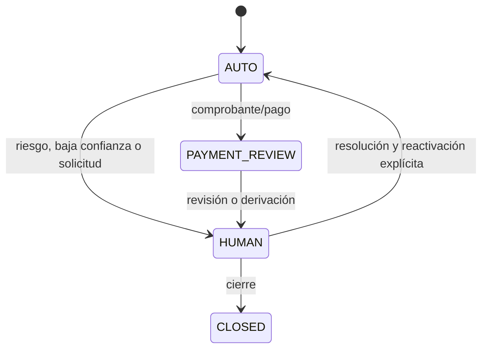
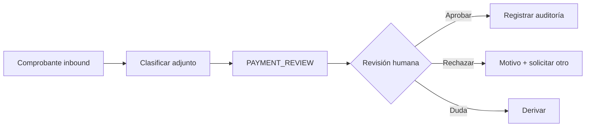
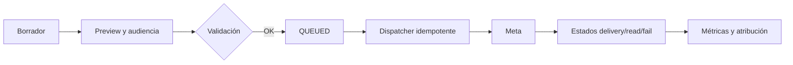
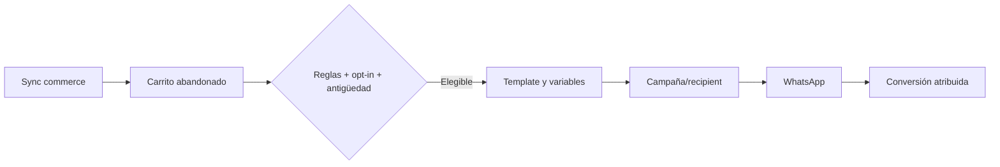
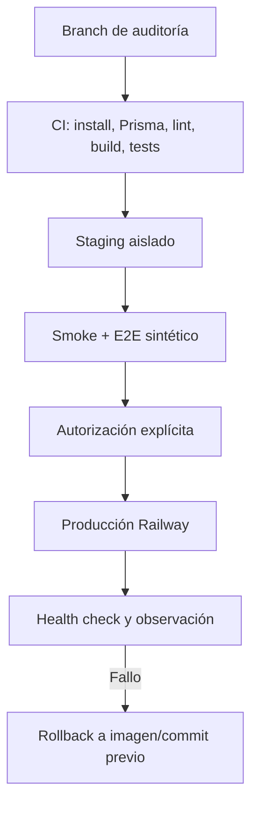

# Auditoría y mejora integral de BotLummine / BladeIA

Fecha de inicio: 2026-07-17  
Rama: `audit/general-improvements-20260717`  
Estado: en progreso; producción permanece en modo solo lectura.

## 1. Resumen ejecutivo

La aplicación tiene una base funcional amplia. La primera iteración cerró los P0 de build incompleto, falso verde E2E, doble compilación de prompt, fallback de proveedores y arranque local accidental contra una base remota. También corrigió selección, borradores y doble envío del Inbox, una fuga global de CSS desde Catálogo y el composer inaccesible en móvil. El `.env` local continúa apuntando a producción; el guard implementado bloquea el arranque local y no se ejecutaron seeds, migraciones ni pruebas con conexión.

## 2. Estado del repositorio local

- Ruta: `D:\01_Proyectos\Proyectos\Plataforma multi marca\BladeIA`.
- Base: `main` y `origin/main` en `c22684f`.
- Rama de trabajo: `audit/general-improvements-20260717`.
- Node local: 22.20.0. npm: 10.9.3.
- Gestor: npm; existen lockfiles en raíz, backend y frontend.
- Cambios previos preservados: ocho archivos versionados (412 inserciones, 36 eliminaciones) y assets/documentos de Instagram sin seguimiento.
- El `.env` de backend coincide con la `DATABASE_URL` de producción. Se considera únicamente apto para observación y no para ejecución local.

## 3. Estado de Railway

- Proyecto: `BladeIA`.
- Producción web: servicio `BladeIA`, commit `c22684f`, rama `main`, `SUCCESS/RUNNING`, Node 22.23.1, runtime V2, una réplica en `us-east4`, health check `/api/health` y HTTP 200 (~481 ms en la muestra inicial).
- Producción cron: servicio `BotLummine`, schedule `0 * * * *`, comando `npm run jobs:campaign-dispatch`. No hubo logs en las últimas 24 horas y no se observó `DATABASE_URL` entre sus variables propias.
- Staging: servicio `BladeIA`, commit `fef6232` del 2026-04-08, sin health check configurado, HTTP 200 (~664 ms). Usa otro host Neon.
- Logs producción: 121 líneas recientes, sin errores/timeouts/reinicios detectados; 47 requests HTTP en 24 h, sin 4xx/5xx ni requests >1 s en la muestra.
- Logs staging: errores recurrentes del campaign dispatcher (18 menciones de error, 15 de Prisma y 9 de timeout en 300 líneas).
- No se expusieron valores secretos ni se realizó ninguna mutación.

## 4. Diferencias local versus desplegado

- Código base local y producción web coinciden en `c22684f`; el working tree local contiene trabajo no publicado.
- Staging está varios meses atrasado y no es representativo del código actual.
- Producción web tiene root directory `/backend`; el cron usa la raíz del repositorio.
- Local usa Node 22.20.0; producción 22.23.1; staging 22.22.2.
- Staging conserva variables legacy y específicas de marca; producción utiliza la configuración moderna por workspace.

## 5. Arquitectura

Frontend React 18, Vite 8, React Router, React Query, Radix y Tailwind 4. Backend Express 5, Prisma 6.19.3 y PostgreSQL. Integraciones: Meta/WhatsApp, Tiendanube, Shopify, Enbox, Gemini, OpenAI y Sentry. Los módulos más grandes superan 1.600 líneas y concentran fetching, estado y presentación o autorización, queries y serialización.

## 6. Flujo de la aplicación

### Autenticación

### Mensaje inbound y respuesta automática

### Handoff humano

### Revisión de pagos

### Campaña

### Recuperación de carrito

### Deployment local y Railway

## 7. Problemas detectados

### FIND-P0-001

- Título: build raíz incompleto
- Área: CI/CD
- Ambiente: local/Railway
- Severidad: High
- Evidencia: `npm run build` solo ejecuta `prisma generate`.
- Impacto: un PR puede pasar sin compilar frontend ni revisar backend.
- Causa: script raíz reducido a una tarea de generación.
- Solución: comando de verificación reproducible para ambos paquetes.
- Estado: resuelto en `cc54042`; el build raíz valida backend y frontend.
- Archivos: `package.json`, workflow de CI.
- Pruebas: baseline confirmó falso positivo.
- Riesgo de deployment: bajo.

### FIND-P0-002

- Título: E2E con falso verde
- Área: QA
- Ambiente: local/CI
- Severidad: High
- Evidencia: `/whatsapp-menu` agotó 15 s, pero el único test terminó `1 passed`.
- Impacto: regresiones de pantallas críticas no bloquean cambios.
- Causa: el test captura excepciones por ruta y no afirma que el reporte esté libre de errores.
- Solución: smoke E2E determinista y aserción de cero errores.
- Estado: resuelto en `cc54042`; el test ahora falla si alguna ruta falla.
- Archivos: `frontend/tests/performance/load-times.spec.js` y nueva suite smoke.
- Pruebas: ejecución de 32,8 s con error registrado y exit code 0.
- Riesgo de deployment: bajo.

### FIND-P0-003

- Título: prompt compilado dos veces por turno
- Área: agente IA
- Ambiente: todos
- Severidad: High
- Evidencia: `chat.service.js` y `conversation-turn.service.js` llaman `buildPrompt`, luego `runAssistantReply` lo vuelve a llamar.
- Impacto: divergencia de trazas, costo de CPU, hashes no canónicos y mayor riesgo de inconsistencias.
- Causa: contrato de generación recibe contexto crudo y no el prompt compilado.
- Solución: compiler canónico y proveedor que reciba un artefacto compilado.
- Estado: resuelto en `d9b31fc`; existe un artefacto canónico versionado y hasheado.
- Archivos: servicios de IA y conversación.
- Pruebas: unitarias con contador de compilación y metadata.
- Riesgo de deployment: medio.

### FIND-P0-004

- Título: fallback de proveedor interrumpido
- Área: agente IA
- Ambiente: todos
- Severidad: High
- Evidencia: un error Gemini no reintentable ejecuta `break`, aunque OpenAI esté en la cadena.
- Impacto: handoff/fallback evitable y menor disponibilidad.
- Causa: retry y provider fallback comparten una clasificación binaria.
- Solución: taxonomía explícita y decisión separada de retry/fallback/handoff.
- Estado: resuelto en `d9b31fc`; retry y fallback usan taxonomía explícita.
- Archivos: `backend/src/services/ai/*`.
- Pruebas: unitarias por clase de error.
- Riesgo de deployment: medio.

### FIND-P0-005

- Título: `.env` local conectado a producción
- Área: seguridad operativa
- Ambiente: local/producción
- Severidad: Critical
- Evidencia: igualdad exacta contra la variable Railway, verificada sin imprimir el valor.
- Impacto: un seed, test o servidor local puede leer/escribir datos reales.
- Causa: ausencia de separación local por defecto.
- Solución: guard de entorno y base local descartable; nunca versionar el secreto.
- Estado: resuelto preventivamente en `744341b`; el arranque local remoto falla antes de abrir puerto o consultar la base.
- Archivos: documentación y scripts seguros futuros.
- Pruebas: comparación de URL redaccionada.
- Riesgo de deployment: ninguno para la mitigación documental.

### FIND-P1-006

- Título: CSS de Catálogo altera el shell de otras rutas
- Área: frontend/responsive
- Ambiente: local/todos
- Severidad: High
- Evidencia: al precargar Catálogo, `CatalogPage.css` inyectaba `.admin-shell { grid-template-columns: 280px 1fr }`; en 768 px sidebar y main quedaban en 280 px.
- Impacto: Inbox móvil inutilizable, contenido cortado y navegación fuera de contexto.
- Causa: estilos de layout global dentro del CSS de una feature lazy.
- Solución: eliminar los selectores globales del feature y proteger el shell móvil con ancho verificable.
- Estado: resuelto.
- Archivos: `CatalogPage.css`, `DashboardLayout.css`, `critical-flow.spec.js`.
- Pruebas: sidebar/main ocupan el ancho disponible y no existe overflow a 768 y 390 px.
- Riesgo de deployment: bajo.

### FIND-P1-007

- Título: composer del Inbox fuera del viewport móvil
- Área: Inbox/UI
- Ambiente: local/todos
- Severidad: High
- Evidencia: a 390x844 el textarea comenzaba en y=879; el contenedor imponía 726 px aunque sólo había 597 px disponibles.
- Impacto: el agente humano no podía responder sin un scroll interno no visible.
- Causa: resta rígida `100dvh - 118px` incompatible con la altura dinámica de navegación.
- Solución: dimensionar el chat activo desde su contenedor real y mantener el scroll en mensajes.
- Estado: resuelto.
- Archivos: `InboxPage.css`, `critical-flow.spec.js`.
- Pruebas: composer dentro del viewport a 390x844 y captura real validada.
- Riesgo de deployment: bajo.

### FIND-P1-008

- Título: trazas de IA legacy contienen payloads amplios y carecen de esquema canónico
- Área: IA/observabilidad
- Ambiente: todos
- Severidad: High
- Evidencia: la traza legacy incluye prompt, respuesta y objetos de contexto, pero no garantiza `traceId`, latencia, tokens ni límites de tamaño.
- Impacto: menor correlación operativa y riesgo de registrar contenido sensible o payloads excesivos.
- Causa: la traza evolucionó como objeto de depuración del AI Lab.
- Solución: traza canónica separada, acotada y sin contenidos, emitida una vez al finalizar cada inbound.
- Estado: resuelto para `processInboundMessage`; persiste la migración de consumidores legacy.
- Archivos: `turn-trace.js`, `chat.service.js`, `ai-turn-trace.test.js`.
- Pruebas: 2 casos verifican límites, hash, normalización y ausencia de prompt/mensaje.
- Riesgo de deployment: bajo; sólo agrega metadata/log estructurado.

## 8. Auditoría UI/UX

- Inbox: selección desktop automática con URL; móvil conserva el flujo progresivo lista → chat; borrador por conversación; error y retry sin pérdida; bloqueo de doble envío.
- Responsive: corregidos shell contaminado por CSS lazy y composer fuera del viewport.
- Estados: el Inbox separa carga, vacío, error y datos; queda pendiente extender el patrón compartido a pagos, campañas y administración.
- Evidencia: capturas deterministas en 1440x960, 1280x800, 768x1024 y 390x844 con datos sintéticos.
- Pendiente: recorrido visual completo de las vistas privadas restantes, teclado integral y axe.

## 9. Auditoría frontend

- Build exitoso en 600 ms en la validación final de esta iteración.
- `vendor-three`: 505,81 kB minificado; warning >500 kB.
- CSS de campañas: 100,63 kB; CSS global principal: 138,47 kB.
- `InboxPage.jsx`: ~1.680 líneas; `AdminPage.jsx`: ~1.965; `CampaignsFeaturePage.jsx`: ~1.774.
- No hay scripts de lint ni typecheck configurados; sigue como deuda P0/P1 de calidad.
- Se añadieron tokens semánticos base, foco visible global y reducción de movimiento.
- Se detectó y eliminó un bloque legacy de estilos globales en `CatalogPage.css`.

## 10. Auditoría backend

- 129 archivos JS/MJS pasan el chequeo de sintaxis.
- 22 pruebas unitarias pasan, incluidas seguridad de DB, compiler/fallback IA y aislamiento de workspace.
- Controllers de dashboard/admin rondan 1.900 líneas.
- Deben auditarse operaciones por ID sin filtro compuesto de workspace y callbacks legacy con defaults.

## 11. Auditoría del agente de IA

Pipeline reconstruido: webhook -> normalización -> persistencia -> workspace/contacto -> historia/estado -> intención/route -> catálogo/pedido/campaña -> prompt -> proveedor -> auditoría -> handoff -> persistencia/delivery. El prompt ahora se compila una vez, con `promptVersion`, SHA-256 y `factsUsed`; los proveedores reciben el mismo artefacto y el fallback continúa según taxonomía. Cada salida de `processInboundMessage` emite una traza canónica acotada con correlación, ruta, intención, proveedor, tokens, latencia, auditoría y handoff, sin prompt ni mensaje. La salida estructurada completa y persistencia/retención de trazas siguen pendientes.

## 12. Seguridad y multitenancy

El schema incluye `workspaceId` e índices relevantes. Se añadieron pruebas negativas: ADMIN y AGENT no pueden reemplazar el workspace mediante params, query, headers o body; PLATFORM_ADMIN sí puede seleccionar uno explícitamente. Persisten como backlog la auditoría exhaustiva de queries por ID, archivos y analytics.

## 13. Railway y despliegues

Producción es solo lectura. Riesgos: cron sin evidencia de ejecución/variables operativas y staging obsoleto. El start productivo aplica migraciones automáticamente; debe revisarse el desacople hacia pre-deploy controlado.

## 14. Accesibilidad

Se incorporaron labels del composer/búsqueda, estados `alert`/`status`, `aria-pressed`, foco visible y `prefers-reduced-motion`. Sigue pendiente la auditoría WCAG 2.2 AA completa con teclado y axe.

## 15. Rendimiento

Medición mock final: rutas internas críticas listas entre 204 y 413 ms; landing pública 531 ms y quiet 1.098 ms. La suite ahora bloquea errores. Sigue abierto `vendor-three` con 505,81 kB minificado y carga anticipada de CSS/JS de campañas e Inbox por prefetch.

## 16. Pruebas

| Comando | Resultado | Tiempo |
|---|---:|---:|
| `npm ci` backend | OK; 11 vulnerabilidades (3 high) | 10,1 s |
| `npm ci` frontend | OK; 5 vulnerabilidades (2 high) | 7,1 s |
| `prisma validate` | OK | 2,5 s |
| backend syntax | 129/129 | incluido en build |
| unit tests | 24/24 | 0,24 s |
| frontend build | OK con warning de chunk | 0,60 s |
| root build | OK; backend + frontend | 8,7 s concurrente con validaciones |
| Playwright Chromium | 5/5; 10 rutas de performance | 14,7 s |

## 17. Cambios implementados

- Build raíz real, CI, syntax check, Prisma y E2E estricto.
- Compiler canónico de prompt, hash/version/facts y taxonomía/fallback de proveedores.
- Guard contra base remota en desarrollo y pruebas negativas de workspace.
- Inbox: selección/URL, borradores, error/retry, doble envío y flujo móvil.
- Tokens semánticos, foco visible, reduced motion y contención responsive.
- Eliminación de fuga CSS de Catálogo.
- Capturas deterministas públicas e Inbox con datos sintéticos.
- Traza canónica redactada por inbound, con límites y cobertura unitaria.

## 18. Comparación antes/después

- Root build: de falso verde (sólo Prisma) a validación de ambos productos.
- Unitarias: de 7 casos localizados a 22 pruebas ejecutadas.
- E2E: de una suite que ocultaba fallos a 5 pruebas bloqueantes.
- Inbox 390 px: de sidebar/contenido de 280 px y composer fuera de pantalla a ancho completo, sin overflow y composer visible.
- Prompt: de dos compilaciones por turno a un artefacto determinista compartido.

## 19. Capturas

Generadas en `frontend/audit-artifacts/screenshots/after/`: landing, precios, contacto y login en 1440x960/390x844; Inbox automático en 1440x960/1280x800; lista/chat en 768x1024/390x844; revisión de pagos en 1440x960. Todas usan fixtures sintéticos. No se conserva una serie completa “before”; la evidencia previa móvil quedó registrada en métricas y hallazgos, limitación declarada para esta iteración.

## 20. Métricas

Baseline disponible en las secciones 3, 15 y 16. No hay métricas confiables de tokens/costo por turno todavía.

## 21. Riesgos pendientes

- Auditoría exhaustiva de aislamiento multitenant por entidad aún incompleta.
- Salida estructurada, persistencia y política de retención de trace IA aún parciales.
- Sin lint, typecheck ni axe configurados.
- Bundle `vendor-three` >500 kB y prefetch costoso.
- Staging no representativo.
- Cron productivo sin evidencia operativa.

## 22. Backlog

P0: build/CI, smoke tests, multitenancy, compiler IA, taxonomía/fallback, trazas.  
P1: inbox, pagos, operaciones, campañas/carritos, estados compartidos y accesibilidad crítica.  
P2: plantillas, catálogo, clientes, AI Lab, rendimiento y responsive amplio.  
P3: analytics, personalización y detalles cosméticos.

## 23. Ejecución local

Hasta preparar una base descartable, sólo ejecutar comandos sin conexión. No usar `backend/.env` para seed, migrate o tests integrados. El guard bloquea el arranque local remoto salvo override explícito. Comandos comprobados: instalación, `npm run build`, `npm run prisma:validate`, `npm run test:unit` y Playwright con API mockeada.

## 24. Validación en staging

No apta todavía: staging debe actualizarse desde un commit revisado, confirmar base separada, desactivar delivery externo y usar fixtures sintéticos antes de pruebas mutantes.

## 25. Plan de deployment

1. CI verde y revisión del diff.
2. Documentar migraciones/variables (idealmente ninguna en el primer lote).
3. Desplegar a staging aislado.
4. Smoke de health/auth/inbox con datos sintéticos y delivery deshabilitado.
5. Autorización explícita.
6. Deploy productivo gradual, observar health/logs/latencia y errores.

## 26. Rollback

- Mantener commit e imagen Railway previos identificados.
- Cambios de aplicación compatibles hacia atrás y sin migración destructiva.
- Ante error: detener rollout, redeploy del commit previo y verificar `/api/health`.
- Si una migración futura fuera necesaria, preparar rollback SQL probado sobre copia descartable; no usar `db push` ni `migrate reset`.
