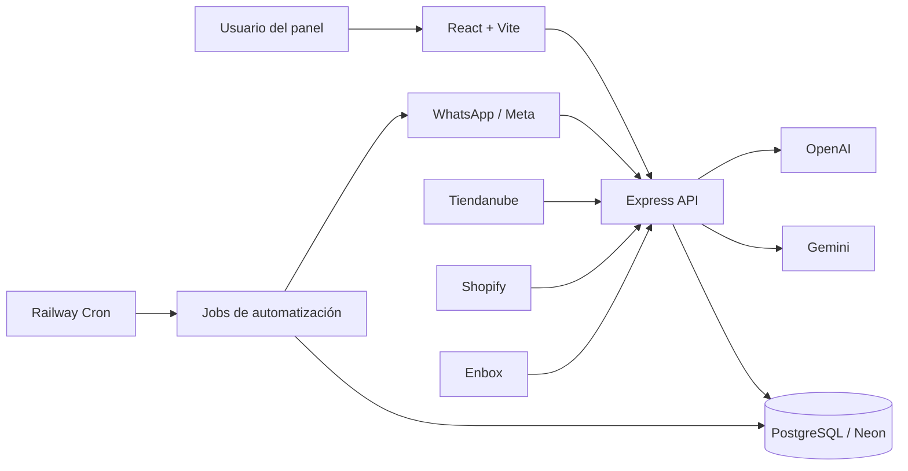
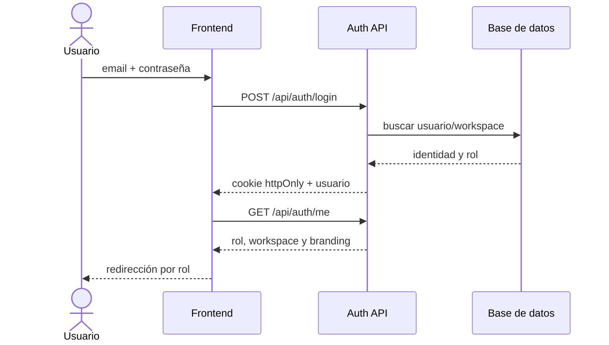
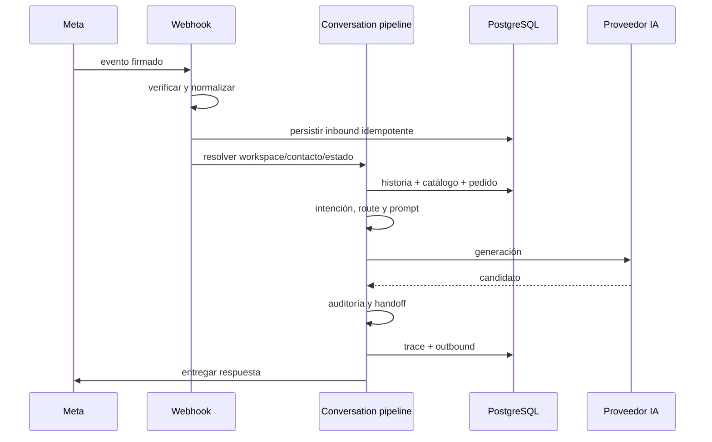
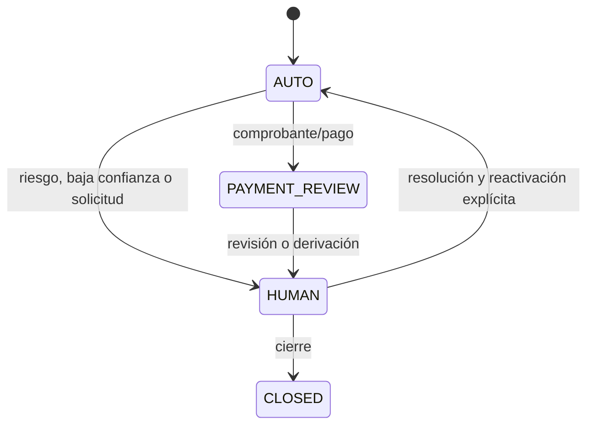
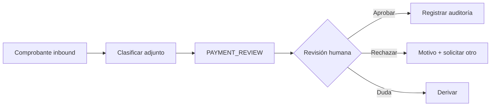
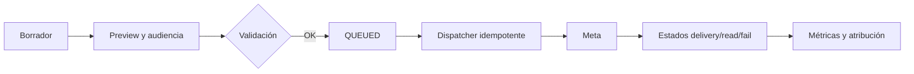
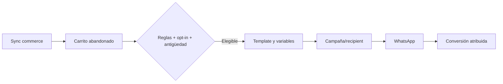
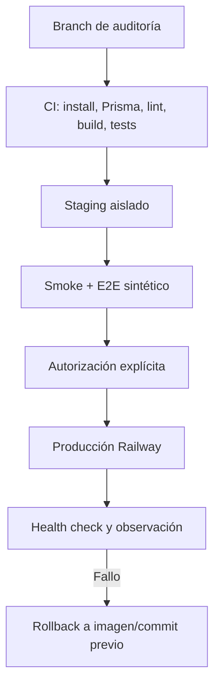

# Auditoría y mejora integral de BotLummine / BladeIA

Fecha de inicio: 2026-07-17  
Rama: `audit/general-improvements-20260717`  
Estado: en progreso; producción permanece en modo solo lectura.

## 1. Resumen ejecutivo

La aplicación tiene una base funcional amplia y el frontend compila, pero el baseline inicial encontró riesgos P0: el comando raíz `build` no valida el producto, el único E2E puede finalizar verde aunque una pantalla falle, el prompt de IA se compila dos veces por turno y la cadena de proveedores puede cortar el fallback disponible. El `.env` local apunta a la base de producción; por seguridad no se inició el backend ni se ejecutaron seeds, migraciones o pruebas con conexión.

## 2. Estado del repositorio local

- Ruta: `D:\01_Proyectos\Proyectos\Plataforma multi marca\BladeIA`.
- Base: `main` y `origin/main` en `c22684f`.
- Rama de trabajo: `audit/general-improvements-20260717`.
- Node local: 22.20.0. npm: 10.9.3.
- Gestor: npm; existen lockfiles en raíz, backend y frontend.
- Cambios previos preservados: ocho archivos versionados (412 inserciones, 36 eliminaciones) y assets/documentos de Instagram sin seguimiento.
- El `.env` de backend coincide con la `DATABASE_URL` de producción. Se considera únicamente apto para observación y no para ejecución local.

## 3. Estado de Railway

- Proyecto: `BladeIA`.
- Producción web: servicio `BladeIA`, commit `c22684f`, rama `main`, `SUCCESS/RUNNING`, Node 22.23.1, runtime V2, una réplica en `us-east4`, health check `/api/health` y HTTP 200 (~481 ms en la muestra inicial).
- Producción cron: servicio `BotLummine`, schedule `0 * * * *`, comando `npm run jobs:campaign-dispatch`. No hubo logs en las últimas 24 horas y no se observó `DATABASE_URL` entre sus variables propias.
- Staging: servicio `BladeIA`, commit `fef6232` del 2026-04-08, sin health check configurado, HTTP 200 (~664 ms). Usa otro host Neon.
- Logs producción: 121 líneas recientes, sin errores/timeouts/reinicios detectados; 47 requests HTTP en 24 h, sin 4xx/5xx ni requests >1 s en la muestra.
- Logs staging: errores recurrentes del campaign dispatcher (18 menciones de error, 15 de Prisma y 9 de timeout en 300 líneas).
- No se expusieron valores secretos ni se realizó ninguna mutación.

## 4. Diferencias local versus desplegado

- Código base local y producción web coinciden en `c22684f`; el working tree local contiene trabajo no publicado.
- Staging está varios meses atrasado y no es representativo del código actual.
- Producción web tiene root directory `/backend`; el cron usa la raíz del repositorio.
- Local usa Node 22.20.0; producción 22.23.1; staging 22.22.2.
- Staging conserva variables legacy y específicas de marca; producción utiliza la configuración moderna por workspace.

## 5. Arquitectura

Frontend React 18, Vite 8, React Router, React Query, Radix y Tailwind 4. Backend Express 5, Prisma 6.19.3 y PostgreSQL. Integraciones: Meta/WhatsApp, Tiendanube, Shopify, Enbox, Gemini, OpenAI y Sentry. Los módulos más grandes superan 1.600 líneas y concentran fetching, estado y presentación o autorización, queries y serialización.

## 6. Flujo de la aplicación

### Autenticación

### Mensaje inbound y respuesta automática

### Handoff humano

### Revisión de pagos

### Campaña

### Recuperación de carrito

### Deployment local y Railway

## 7. Problemas detectados

### FIND-P0-001

- Título: build raíz incompleto
- Área: CI/CD
- Ambiente: local/Railway
- Severidad: High
- Evidencia: `npm run build` solo ejecuta `prisma generate`.
- Impacto: un PR puede pasar sin compilar frontend ni revisar backend.
- Causa: script raíz reducido a una tarea de generación.
- Solución: comando de verificación reproducible para ambos paquetes.
- Estado: pendiente.
- Archivos: `package.json`, workflow de CI.
- Pruebas: baseline confirmó falso positivo.
- Riesgo de deployment: bajo.

### FIND-P0-002

- Título: E2E con falso verde
- Área: QA
- Ambiente: local/CI
- Severidad: High
- Evidencia: `/whatsapp-menu` agotó 15 s, pero el único test terminó `1 passed`.
- Impacto: regresiones de pantallas críticas no bloquean cambios.
- Causa: el test captura excepciones por ruta y no afirma que el reporte esté libre de errores.
- Solución: smoke E2E determinista y aserción de cero errores.
- Estado: pendiente.
- Archivos: `frontend/tests/performance/load-times.spec.js` y nueva suite smoke.
- Pruebas: ejecución de 32,8 s con error registrado y exit code 0.
- Riesgo de deployment: bajo.

### FIND-P0-003

- Título: prompt compilado dos veces por turno
- Área: agente IA
- Ambiente: todos
- Severidad: High
- Evidencia: `chat.service.js` y `conversation-turn.service.js` llaman `buildPrompt`, luego `runAssistantReply` lo vuelve a llamar.
- Impacto: divergencia de trazas, costo de CPU, hashes no canónicos y mayor riesgo de inconsistencias.
- Causa: contrato de generación recibe contexto crudo y no el prompt compilado.
- Solución: compiler canónico y proveedor que reciba un artefacto compilado.
- Estado: pendiente.
- Archivos: servicios de IA y conversación.
- Pruebas: unitarias con contador de compilación y metadata.
- Riesgo de deployment: medio.

### FIND-P0-004

- Título: fallback de proveedor interrumpido
- Área: agente IA
- Ambiente: todos
- Severidad: High
- Evidencia: un error Gemini no reintentable ejecuta `break`, aunque OpenAI esté en la cadena.
- Impacto: handoff/fallback evitable y menor disponibilidad.
- Causa: retry y provider fallback comparten una clasificación binaria.
- Solución: taxonomía explícita y decisión separada de retry/fallback/handoff.
- Estado: pendiente.
- Archivos: `backend/src/services/ai/*`.
- Pruebas: unitarias por clase de error.
- Riesgo de deployment: medio.

### FIND-P0-005

- Título: `.env` local conectado a producción
- Área: seguridad operativa
- Ambiente: local/producción
- Severidad: Critical
- Evidencia: igualdad exacta contra la variable Railway, verificada sin imprimir el valor.
- Impacto: un seed, test o servidor local puede leer/escribir datos reales.
- Causa: ausencia de separación local por defecto.
- Solución: guard de entorno y base local descartable; nunca versionar el secreto.
- Estado: mitigado operativamente; no se ejecutan comandos con conexión.
- Archivos: documentación y scripts seguros futuros.
- Pruebas: comparación de URL redaccionada.
- Riesgo de deployment: ninguno para la mitigación documental.

## 8. Auditoría UI/UX

Pendiente de capturas reales. Baseline técnico: el bundle carga recursos de campañas e inbox en rutas que no los necesitan; la pantalla WhatsApp Menu no alcanzó su selector esperado en el E2E.

## 9. Auditoría frontend

- Build exitoso en 776 ms.
- `vendor-three`: 505,81 kB minificado; warning >500 kB.
- CSS de campañas: 100,63 kB; CSS global principal: 138,47 kB.
- `InboxPage.jsx`: ~1.680 líneas; `AdminPage.jsx`: ~1.965; `CampaignsFeaturePage.jsx`: ~1.774.
- No hay scripts de lint ni typecheck configurados.

## 10. Auditoría backend

- 124 archivos JS/MJS pasan `node --check`.
- Un único test unitario localizado: 7/7 casos pasan.
- Controllers de dashboard/admin rondan 1.900 líneas.
- Deben auditarse operaciones por ID sin filtro compuesto de workspace y callbacks legacy con defaults.

## 11. Auditoría del agente de IA

Pipeline preliminar: webhook -> normalización -> persistencia -> workspace/contacto -> historia/estado -> intención/route -> catálogo/pedido/campaña -> prompt -> proveedor -> auditoría -> handoff -> persistencia/delivery. Se confirmó doble compilación y fallback acoplado a retry. La salida aún no está normalizada al schema objetivo ni existe traza canónica completa por turno.

## 12. Seguridad y multitenancy

El schema incluye `workspaceId` e índices relevantes. Existen helpers `requireRequestWorkspaceId`, pero también defaults `DEFAULT_WORKSPACE_ID` y queries por `id` que requieren análisis contextual. No se afirmará aislamiento hasta contar con pruebas negativas.

## 13. Railway y despliegues

Producción es solo lectura. Riesgos: cron sin evidencia de ejecución/variables operativas y staging obsoleto. El start productivo aplica migraciones automáticamente; debe revisarse el desacople hacia pre-deploy controlado.

## 14. Accesibilidad

Pendiente de auditoría WCAG 2.2 AA con teclado y axe sobre vistas críticas.

## 15. Rendimiento

Medición mock inicial: rutas internas listas entre 136 y 406 ms; landing pública 3.067 ms por carga de fuentes/assets. La suite no es estricta por defecto y una ruta falló sin bloquear.

## 16. Pruebas

| Comando | Resultado | Tiempo |
|---|---:|---:|
| `npm ci` backend | OK; 11 vulnerabilidades (3 high) | 10,1 s |
| `npm ci` frontend | OK; 5 vulnerabilidades (2 high) | 7,1 s |
| `prisma validate` | OK | 2,0 s |
| backend `node --check` | 124/124 | 4,3 s |
| unit test existente | 7/7 | 0,15 s |
| frontend build | OK con warning de chunk | 1,66 s |
| root build | falso positivo: solo Prisma | 2,38 s |
| Playwright | 1 passed; 1 ruta interna falló | 32,8 s |

## 17. Cambios implementados

- Creación de rama segura.
- Creación del presente reporte. El código todavía no fue alterado al registrar este baseline.

## 18. Comparación antes/después

Se completará por iteración con tiempos, tamaños, cobertura y capturas.

## 19. Capturas

Pendientes. Se usarán datos sintéticos y viewports 1440x960, 1280x800, 768x1024 y 390x844.

## 20. Métricas

Baseline disponible en las secciones 3, 15 y 16. No hay métricas confiables de tokens/costo por turno todavía.

## 21. Riesgos pendientes

- Conexión local accidental a producción.
- Falsos verdes de CI/E2E.
- Aislamiento multitenant sin cobertura negativa suficiente.
- Doble compilación del prompt y fallback incompleto.
- Staging no representativo.
- Cron productivo sin evidencia operativa.

## 22. Backlog

P0: build/CI, smoke tests, multitenancy, compiler IA, taxonomía/fallback, trazas.  
P1: inbox, pagos, operaciones, campañas/carritos, estados compartidos y accesibilidad crítica.  
P2: plantillas, catálogo, clientes, AI Lab, rendimiento y responsive amplio.  
P3: analytics, personalización y detalles cosméticos.

## 23. Ejecución local

Hasta preparar una base descartable, solo ejecutar comandos sin conexión. No usar `backend/.env` para servidor, seed, migrate o tests integrados. Comandos seguros comprobados: instalación, `prisma validate`, `prisma generate`, `node --check`, unit tests puros y build frontend.

## 24. Validación en staging

No apta todavía: staging debe actualizarse desde un commit revisado, confirmar base separada, desactivar delivery externo y usar fixtures sintéticos antes de pruebas mutantes.

## 25. Plan de deployment

1. CI verde y revisión del diff.
2. Documentar migraciones/variables (idealmente ninguna en el primer lote).
3. Desplegar a staging aislado.
4. Smoke de health/auth/inbox con datos sintéticos y delivery deshabilitado.
5. Autorización explícita.
6. Deploy productivo gradual, observar health/logs/latencia y errores.

## 26. Rollback

- Mantener commit e imagen Railway previos identificados.
- Cambios de aplicación compatibles hacia atrás y sin migración destructiva.
- Ante error: detener rollout, redeploy del commit previo y verificar `/api/health`.
- Si una migración futura fuera necesaria, preparar rollback SQL probado sobre copia descartable; no usar `db push` ni `migrate reset`.
