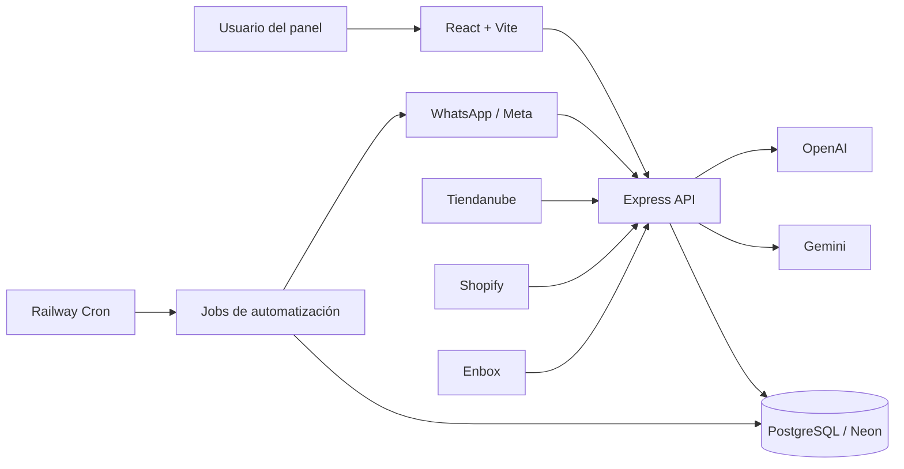
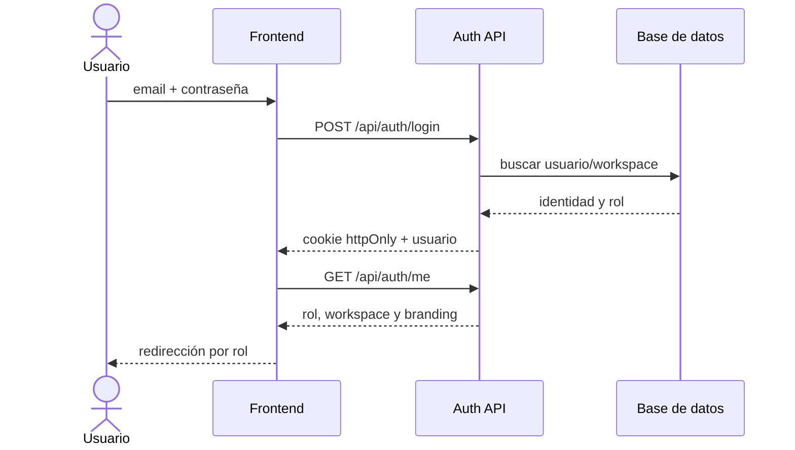
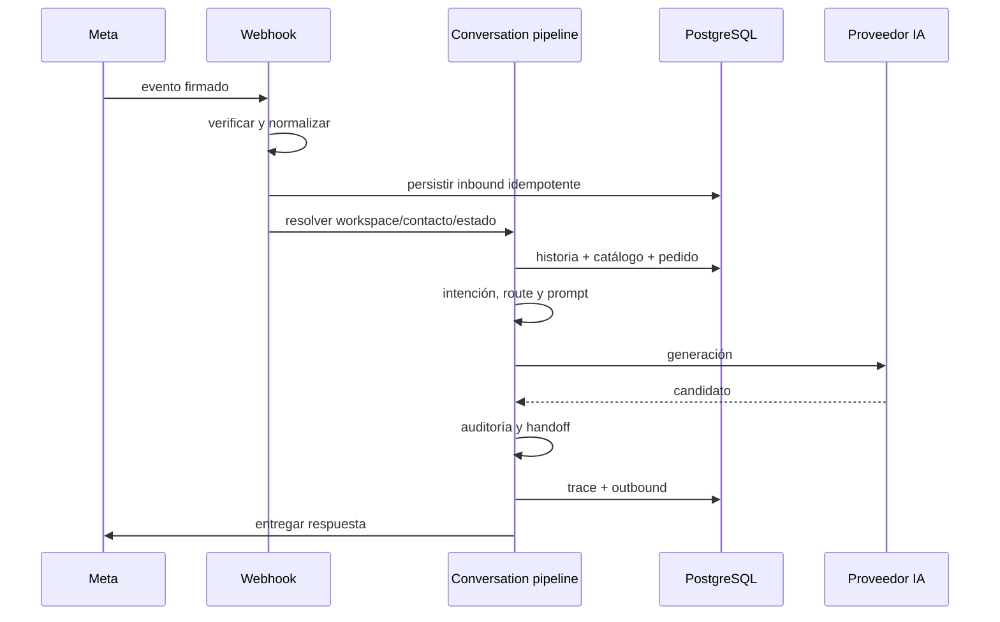
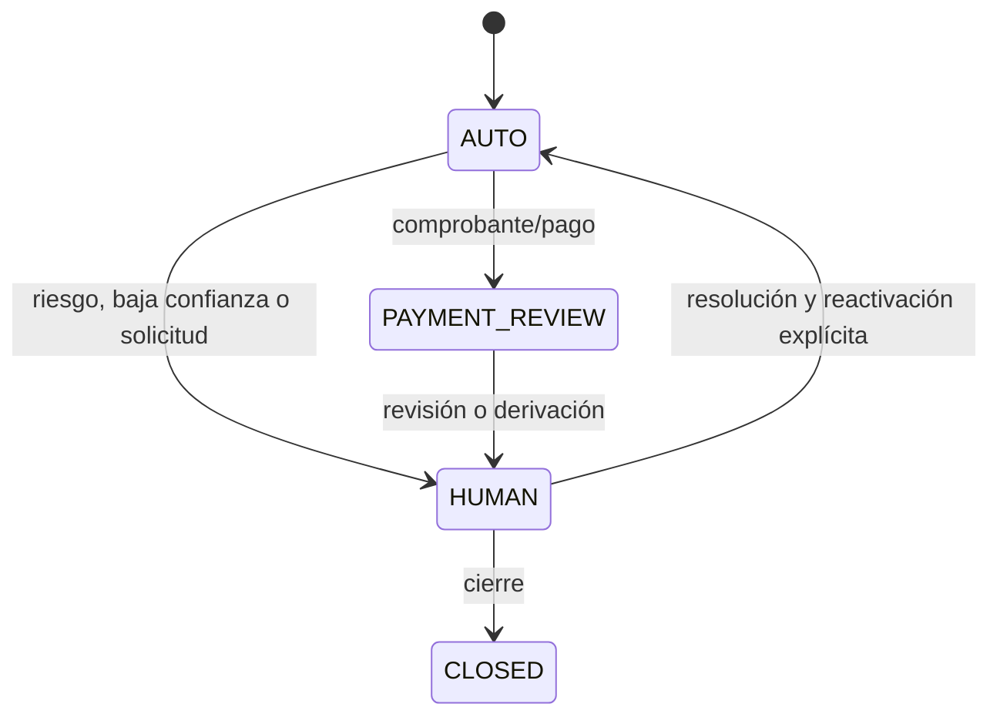
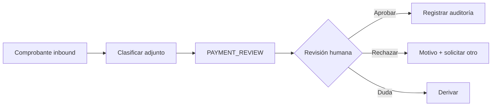
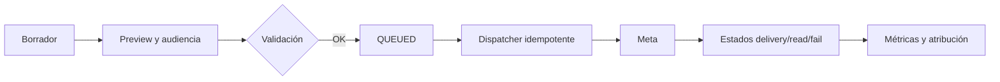
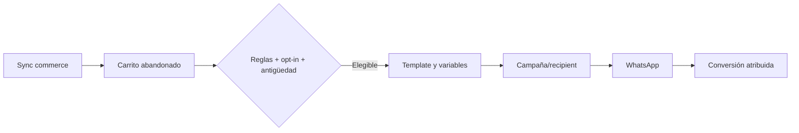
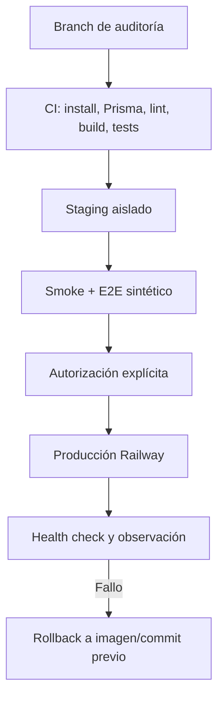

# Auditoría y mejora integral de BotLummine / BladeIA

Fecha de inicio: 2026-07-17
Rama: `audit/general-improvements-20260717`
Estado: P0 local de hardening cerrado para el inventario estático actual; producción permanece en modo solo lectura.

## 1. Resumen ejecutivo

La aplicación tiene una base funcional amplia. La iteración cerró los P0 locales seguros de build incompleto, falso verde E2E, doble compilación de prompt, fallback de proveedores, fronteras multitenant prioritarias y arranque accidental contra una base remota. También corrigió selección, borradores y doble envío del Inbox, una fuga global de CSS desde Catálogo y el composer inaccesible en móvil. La validación final sobre un worktree limpio de `69f6b86` dejó Prisma válido, build raíz verde, 85/85 unitarias, TypeScript sin errores, auditorías productivas en cero y 22/22 Playwright con performance estricto. El `.env` local continúa apuntando a producción; el guard implementado bloquea el arranque local y no se ejecutaron seeds, migraciones ni pruebas con conexión.

## 2. Estado del repositorio local

- Ruta: `D:\01_Proyectos\Proyectos\Plataforma multi marca\BladeIA`.
- Base: `main` y `origin/main` en `c22684f`.
- Rama de trabajo: `audit/general-improvements-20260717`.
- Node local: 22.20.0. npm: 10.9.3.
- Gestor: npm; existen lockfiles en raíz, backend y frontend.
- Cambios previos preservados: ocho archivos versionados (412 inserciones, 36 eliminaciones) y assets/documentos de Instagram sin seguimiento.
- El `.env` de backend coincide con la `DATABASE_URL` de producción. Se considera únicamente apto para observación y no para ejecución local.

## 3. Estado de Railway

- Proyecto: `BladeIA`.
- Producción web: servicio `BladeIA`, commit `c22684f`, rama `main`, `SUCCESS/RUNNING`, Node 22.23.1, runtime V2, una réplica en `us-east4`, health check `/api/health` y HTTP 200 (~481 ms en la muestra inicial).
- Producción cron: servicio `BotLummine`, schedule `0 * * * *`, comando `npm run jobs:campaign-dispatch`. No hubo logs en las últimas 24 horas y no se observó `DATABASE_URL` entre sus variables propias.
- Staging: servicio `BladeIA`, commit `fef6232` del 2026-04-08, sin health check configurado, HTTP 200 (~664 ms). Usa otro host Neon.
- Logs producción: 121 líneas recientes, sin errores/timeouts/reinicios detectados; 47 requests HTTP en 24 h, sin 4xx/5xx ni requests >1 s en la muestra.
- Logs staging: errores recurrentes del campaign dispatcher (18 menciones de error, 15 de Prisma y 9 de timeout en 300 líneas).
- No se expusieron valores secretos ni se realizó ninguna mutación.

## 4. Diferencias local versus desplegado

- Código base local y producción web coinciden en `c22684f`; el working tree local contiene trabajo no publicado.
- Staging está varios meses atrasado y no es representativo del código actual.
- Producción web tiene root directory `/backend`; el cron usa la raíz del repositorio.
- Local usa Node 22.20.0; producción 22.23.1; staging 22.22.2.
- Staging conserva variables legacy y específicas de marca; producción utiliza la configuración moderna por workspace.

## 5. Arquitectura



Frontend React 18, Vite 8, React Router, React Query, Radix y Tailwind 4. Backend Express 5, Prisma 6.19.3 y PostgreSQL. Integraciones: Meta/WhatsApp, Tiendanube, Shopify, Enbox, Gemini, OpenAI y Sentry. Los módulos más grandes superan 1.600 líneas y concentran fetching, estado y presentación o autorización, queries y serialización.

## 6. Flujo de la aplicación

### Autenticación



### Mensaje inbound y respuesta automática



### Handoff humano



### Revisión de comprobantes



### Campaña



### Recuperación de carrito



### Deployment local y Railway



## 7. Problemas detectados

### FIND-P0-001

- Título: build raíz incompleto
- Área: CI/CD
- Ambiente: local/Railway
- Severidad: High
- Evidencia: `npm run build` solo ejecuta `prisma generate`.
- Impacto: un PR puede pasar sin compilar frontend ni revisar backend.
- Causa: script raíz reducido a una tarea de generación.
- Solución: comando de verificación reproducible para ambos paquetes.
- Estado: resuelto en `cc54042`; el build raíz valida backend y frontend.
- Archivos: `package.json`, workflow de CI.
- Pruebas: baseline confirmó falso positivo.
- Riesgo de deployment: bajo.

### FIND-P0-002

- Título: E2E con falso verde
- Área: QA
- Ambiente: local/CI
- Severidad: High
- Evidencia: `/whatsapp-menu` agotó 15 s, pero el único test terminó `1 passed`.
- Impacto: regresiones de pantallas críticas no bloquean cambios.
- Causa: el test captura excepciones por ruta y no afirma que el reporte esté libre de errores.
- Solución: smoke E2E determinista y aserción de cero errores.
- Estado: resuelto en `cc54042`; el test ahora falla si alguna ruta falla.
- Archivos: `frontend/tests/performance/load-times.spec.js` y nueva suite smoke.
- Pruebas: ejecución de 32,8 s con error registrado y exit code 0.
- Riesgo de deployment: bajo.

### FIND-P0-003

- Título: prompt compilado dos veces por turno
- Área: agente IA
- Ambiente: todos
- Severidad: High
- Evidencia: `chat.service.js` y `conversation-turn.service.js` llaman `buildPrompt`, luego `runAssistantReply` lo vuelve a llamar.
- Impacto: divergencia de trazas, costo de CPU, hashes no canónicos y mayor riesgo de inconsistencias.
- Causa: contrato de generación recibe contexto crudo y no el prompt compilado.
- Solución: compiler canónico y proveedor que reciba un artefacto compilado.
- Estado: resuelto en `d9b31fc`; existe un artefacto canónico versionado y hasheado.
- Archivos: servicios de IA y conversación.
- Pruebas: unitarias con contador de compilación y metadata.
- Riesgo de deployment: medio.

### FIND-P0-004

- Título: fallback de proveedor interrumpido
- Área: agente IA
- Ambiente: todos
- Severidad: High
- Evidencia: un error Gemini no reintentable ejecuta `break`, aunque OpenAI esté en la cadena.
- Impacto: handoff/fallback evitable y menor disponibilidad.
- Causa: retry y provider fallback comparten una clasificación binaria.
- Solución: taxonomía explícita y decisión separada de retry/fallback/handoff.
- Estado: resuelto en `d9b31fc`; retry y fallback usan taxonomía explícita.
- Archivos: `backend/src/services/ai/*`.
- Pruebas: unitarias por clase de error.
- Riesgo de deployment: medio.

### FIND-P0-005

- Título: `.env` local conectado a producción
- Área: seguridad operativa
- Ambiente: local/producción
- Severidad: Critical
- Evidencia: igualdad exacta contra la variable Railway, verificada sin imprimir el valor.
- Impacto: un seed, test o servidor local puede leer/escribir datos reales.
- Causa: ausencia de separación local por defecto.
- Solución: guard de entorno y base local descartable; nunca versionar el secreto.
- Estado: resuelto preventivamente en `744341b`; el arranque local remoto falla antes de abrir puerto o consultar la base.
- Archivos: documentación y scripts seguros futuros.
- Pruebas: comparación de URL redaccionada.
- Riesgo de deployment: ninguno para la mitigación documental.

### FIND-P1-006

- Título: CSS de Catálogo altera el shell de otras rutas
- Área: frontend/responsive
- Ambiente: local/todos
- Severidad: High
- Evidencia: al precargar Catálogo, `CatalogPage.css` inyectaba `.admin-shell { grid-template-columns: 280px 1fr }`; en 768 px sidebar y main quedaban en 280 px.
- Impacto: Inbox móvil inutilizable, contenido cortado y navegación fuera de contexto.
- Causa: estilos de layout global dentro del CSS de una feature lazy.
- Solución: eliminar los selectores globales del feature y proteger el shell móvil con ancho verificable.
- Estado: resuelto.
- Archivos: `CatalogPage.css`, `DashboardLayout.css`, `critical-flow.spec.js`.
- Pruebas: sidebar/main ocupan el ancho disponible y no existe overflow a 768 y 390 px.
- Riesgo de deployment: bajo.

### FIND-P1-007

- Título: composer del Inbox fuera del viewport móvil
- Área: Inbox/UI
- Ambiente: local/todos
- Severidad: High
- Evidencia: a 390x844 el textarea comenzaba en y=879; el contenedor imponía 726 px aunque sólo había 597 px disponibles.
- Impacto: el agente humano no podía responder sin un scroll interno no visible.
- Causa: resta rígida `100dvh - 118px` incompatible con la altura dinámica de navegación.
- Solución: dimensionar el chat activo desde su contenedor real y mantener el scroll en mensajes.
- Estado: resuelto.
- Archivos: `InboxPage.css`, `critical-flow.spec.js`.
- Pruebas: composer dentro del viewport a 390x844 y captura real validada.
- Riesgo de deployment: bajo.

### FIND-P1-008

- Título: trazas de IA legacy contienen payloads amplios y carecen de esquema canónico
- Área: IA/observabilidad
- Ambiente: todos
- Severidad: High
- Evidencia: la traza legacy incluye prompt, respuesta y objetos de contexto, pero no garantiza `traceId`, latencia, tokens ni límites de tamaño.
- Impacto: menor correlación operativa y riesgo de registrar contenido sensible o payloads excesivos.
- Causa: la traza evolucionó como objeto de depuración del AI Lab.
- Solución: traza canónica separada, acotada y sin contenidos, emitida una vez al finalizar cada inbound.
- Estado: resuelto para `processInboundMessage`; persiste la migración de consumidores legacy.
- Archivos: `turn-trace.js`, `chat.service.js`, `ai-turn-trace.test.js`.
- Pruebas: 2 casos verifican límites, hash, normalización y ausencia de prompt/mensaje.
- Riesgo de deployment: bajo; sólo agrega metadata/log estructurado.

### FIND-P0-009

- Título: respuestas de proveedor sin schema interno validado
- Área: agente IA
- Ambiente: todos
- Severidad: High
- Evidencia: los proveedores devolvían texto libre; una respuesta vacía podía atravesar la cadena sin contrato estructurado.
- Impacto: handoff, intención, hechos usados y flags no tenían un contrato común previo al delivery.
- Causa: adaptación directa de `text` desde cada SDK.
- Solución: schema canónico backward-compatible, normalización de proveedores y revalidación después de la auditoría de respuesta.
- Estado: resuelto.
- Archivos: `assistant-output.js`, `index.js`, ambos servicios de conversación y tests.
- Pruebas: salida legacy normalizada, rechazo de vacío/handoff incompleto y fallback ante `INVALID_OUTPUT`.
- Riesgo de deployment: medio-bajo; conserva `text` y agrega `output`.

### FIND-P0-010

- Título: reproceso inbound podía adoptar el workspace del mensaje buscado sólo por ID
- Área: seguridad/multitenancy
- Ambiente: todos
- Severidad: Critical
- Evidencia: `existingInboundMessageId` usaba `message.findUnique({ id })` y luego asignaba `resolvedWorkspaceId = inboundMessage.workspaceId`.
- Impacto: un ID incorrecto en el contrato interno podía cruzar el límite de tenant durante el reproceso.
- Causa: el workspace se trataba como dato recuperado y no como frontera inmutable de la operación.
- Solución: lookup obligatorio por `id + workspaceId + direction=INBOUND`; nunca reemplazar el workspace esperado.
- Estado: resuelto.
- Archivos: `workspace-scope.js`, `workspace-scope.test.mjs`, `chat.service.js`.
- Pruebas: rechazo de scopes incompletos y aserción exacta del filtro Prisma.
- Riesgo de deployment: bajo; los reprocesos válidos ya disponen de workspace.

### FIND-P0-011

- Título: vulnerabilidades high en dependencias productivas backend
- Área: seguridad/DevOps
- Ambiente: local/todos
- Severidad: High
- Evidencia: npm audit inicial reportó 11 vulnerabilidades (3 high), incluyendo CRLF injection, DoS de uploads y DoS/memory disclosure en WebSocket.
- Impacto: superficie evitable en uploads, multipart y dependencias del proveedor OpenAI.
- Causa: lockfile con versiones anteriores a los parches disponibles.
- Solución: upgrades compatibles y audit high bloqueante en CI.
- Estado: resuelto backend y frontend; `69f6b86` actualiza únicamente dependencias transitivas dentro de los rangos declarados y deja ambas auditorías productivas en cero.
- Archivos: `backend/package.json`, lockfile y workflow.
- Pruebas: `npm audit --omit=dev --audit-level=high` devuelve 0 vulnerabilidades; build y unitarias verdes.
- Riesgo de deployment: medio; revisar smoke de uploads/Sentry en staging.

### FIND-P1-012

- Título: menú móvil sin gestión de foco y label de contraseña contaminado
- Área: accesibilidad/frontend
- Ambiente: todos
- Severidad: High
- Evidencia: el overlay no enfocaba contenido ni respondía a Escape; el botón “Mostrar” estaba dentro del `<label>` y pasaba a formar parte del nombre del input.
- Impacto: navegación confusa o bloqueante para teclado y lectores de pantalla.
- Causa: estado visual/ARIA sin ciclo de foco y label envolviendo un control interactivo.
- Solución: diálogo modal con foco inicial, trap, Escape/restauración; labels por `htmlFor/id` y focus ring visible.
- Estado: resuelto.
- Archivos: `LoginPage.jsx`, `LoginPage.css`, prueba Playwright de teclado.
- Pruebas: 2/2 escenarios críticos de accesibilidad.
- Riesgo de deployment: bajo.

### FIND-P0-013

- Título: envío outbound permitía buscar conversaciones sin scope de workspace
- Área: seguridad/multitenancy
- Ambiente: todos
- Severidad: Critical
- Evidencia: `sendAndPersistOutbound` hacía `conversation.findUnique({ id })` cuando el caller omitía `workspaceId`; nueve llamadas internas no explicitaban el tenant.
- Impacto: un caller interno nuevo o manipulado podía resolver una conversación de otro workspace y usar su configuración/canal de delivery.
- Causa: el scope era opcional en el contrato del servicio compartido.
- Solución: `workspaceId` obligatorio, lookup canónico por `id + workspaceId` y propagación explícita por todos los callers.
- Estado: resuelto.
- Archivos: `workspace-scope.js`, `outbound-message.service.js`, AI Lab, chat, menú y prueba negativa.
- Pruebas: query exacto cubierto; 30/30 unitarias y build raíz verdes.
- Riesgo de deployment: bajo; los flujos válidos ya conocen el workspace de la conversación.

### FIND-P0-014

- Título: webhooks de plantillas descartaban la frontera WABA del sobre
- Área: seguridad/multitenancy/WhatsApp
- Ambiente: todos
- Severidad: High
- Evidencia: `processTemplateWebhook` omitía `entry.id`; si `value` no incluía `waba_id`, los cuatro handlers buscaban sólo por `metaTemplateId`.
- Impacto: una actualización de plantilla podía resolverse sin delimitar la cuenta de WhatsApp Business asociada al workspace.
- Causa: el sobre y el payload interno se procesaban por separado y el scope externo era opcional.
- Solución: propagar `entry.id`, exigir `metaTemplateId + wabaId` y rechazar scopes ausentes o inconsistentes.
- Estado: resuelto.
- Archivos: `webhook.controller.js`, `whatsapp-template.service.js`, `workspace-scope.js` y prueba negativa.
- Pruebas: 31/31 unitarias, 136 archivos con sintaxis válida y build raíz verde.
- Riesgo de deployment: bajo; los webhooks válidos de Meta incluyen el WABA en `entry.id`.

### FIND-P0-015

- Título: analytics eliminaba el scope cuando no había workspaces accesibles
- Área: seguridad/multitenancy/analytics
- Ambiente: todos
- Severidad: High
- Evidencia: ocho agregaciones reemplazaban el filtro por `undefined` o sólo por fecha cuando `workspaceIds` estaba vacío.
- Impacto: el endpoint consultaba datos de todos los tenants aunque el mapeo posterior descartara las filas; aumentaba costo y dejaba una futura fuga a un cambio de serialización.
- Causa: se interpretó una lista vacía como ausencia de filtro en vez de ausencia de acceso.
- Solución: constructor canónico que siempre produce `workspaceId: { in: [...] }`; una lista vacía permanece restrictiva.
- Estado: resuelto.
- Archivos: `admin.controller.js`, `workspace-scope.js` y prueba negativa.
- Pruebas: 32/32 unitarias y build backend con 136 archivos válidos.
- Riesgo de deployment: bajo; no cambia resultados válidos y evita lecturas innecesarias.

### FIND-P0-016

- Título: adjuntos autenticados permitían caché pública compartida
- Área: seguridad/archivos
- Ambiente: todos
- Severidad: High
- Evidencia: `/api/media/inbox/:fileName` requiere autenticación y scope, pero respondía `Cache-Control: public, max-age=31536000, immutable`.
- Impacto: proxies o caches compartidos podían conservar documentos, imágenes o comprobantes privados durante un año fuera del control de sesión.
- Causa: se reutilizó una política apropiada para assets públicos en contenido sensible del Inbox.
- Solución: política canónica `private, no-store`, compatibilidad anti-cache y `X-Content-Type-Options: nosniff`.
- Estado: resuelto.
- Archivos: `media.controller.js`, `http-cache-policy.js` y prueba unitaria.
- Pruebas: 34/34 unitarias y build backend con 138 archivos válidos.
- Riesgo de deployment: bajo; aumenta requests de adjuntos a cambio de evitar persistencia no controlada.

### FIND-P0-017

- Título: cooldown automático operaba estados y mensajes sólo por conversationId
- Área: seguridad/multitenancy/agente IA
- Ambiente: todos
- Severidad: Critical
- Evidencia: carga, claim, unlock y limpieza de `pendingAutoReply` ignoraban el `workspaceId` recibido; el mensaje pendiente tampoco lo filtraba y el reproceso prefería el argumento sobre el tenant persistido.
- Impacto: una asociación interna incorrecta podía reclamar o reprocesar estado de otra conversación/tenant y disparar una respuesta con configuración equivocada.
- Causa: `ConversationState` no posee `workspaceId` directo y el código no aplicaba filtro relacional mediante `conversation.workspaceId`.
- Solución: scope canónico relacional, workspace obligatorio al programar/procesar y filtro del mensaje inbound por el mismo tenant.
- Estado: resuelto.
- Archivos: `chat.service.js`, `workspace-scope.js` y prueba negativa.
- Pruebas: 35/35 unitarias, tipo Prisma verificado y build backend verde.
- Riesgo de deployment: bajo; todos los callers actuales ya suministran el workspace correcto.

### FIND-P0-018

- Título: selección de conexión comercial primaria aceptaba un ID global
- Área: seguridad/multitenancy/comercio
- Ambiente: todos
- Severidad: Critical
- Evidencia: `markPrimaryCommerceConnection` desactivaba conexiones del workspace solicitado y luego ejecutaba `update({ id: connectionId })` sin comprobar pertenencia.
- Impacto: un ID incorrecto podía modificar otro tenant y además dejar al workspace legítimo sin conexión primaria.
- Causa: el caller era considerado confiable y la precondición no formaba parte de la transacción.
- Solución: lookup canónico por `id + workspaceId` al inicio de la transacción; ante ausencia se aborta antes de cualquier escritura.
- Estado: resuelto.
- Archivos: `active-commerce.service.js`, `workspace-scope.js` y prueba negativa genérica.
- Pruebas: 36/36 unitarias y build backend con 138 archivos válidos.
- Riesgo de deployment: bajo; callers válidos usan conexiones del workspace esperado.

### FIND-P0-019

- Título: helpers compartidos de menú y handoff mutaban conversaciones por ID global
- Área: seguridad/multitenancy/conversación
- Ambiente: todos
- Severidad: Critical
- Evidencia: `patchConversationState`, `syncHumanHandoff` y `enableAutomaticConversation` no recibían workspace y usaban `upsert/update({ id })`.
- Impacto: un caller interno con ID incorrecto podía alterar queue, estado de IA o memoria de otra conversación.
- Causa: los helpers nacieron como utilidades internas antes de consolidar el límite multitenant.
- Solución: workspace obligatorio, validación transaccional de pertenencia y propagación en menú, chat y AI Lab.
- Estado: resuelto.
- Archivos: `menu-flow.service.js`, `chat.service.js`, `ai-lab.service.js` y helper de scope.
- Pruebas: 36/36 unitarias, todos los callers inspeccionados y build backend verde.
- Riesgo de deployment: medio-bajo; agrega consultas de validación y todos los callers activos suministran workspace.

### FIND-P1-020

- Título: Inbox mostraba estados vacíos durante errores de lista e historial
- Área: UI/UX/Inbox/comprobantes
- Ambiente: todos
- Severidad: High
- Evidencia: al fallar `inboxQuery` o `conversationQuery`, las condiciones de empty seguían activas y el composer permanecía habilitado con historial no disponible.
- Impacto: el operador interpretaba un fallo como ausencia de trabajo y podía intentar responder sin contexto.
- Causa: loading y empty estaban separados, pero error no participaba en las condiciones de render/disabled.
- Solución: errores explícitos con reintento, empty mutuamente excluyente, composer bloqueado y borrador preservado.
- Estado: resuelto.
- Archivos: `InboxPage.jsx/css`, `OperationsPage.jsx`, `InternalPage.jsx` y Playwright.
- Pruebas: 8/8 E2E; el caso agota retries automáticos y recupera lista/historial manualmente.
- Riesgo de deployment: bajo.

### FIND-P1-021

- Título: Administración confundía fallas de carga con resultados vacíos
- Área: UI/UX/Administración/Analytics
- Ambiente: todos
- Severidad: High
- Evidencia: la lista de marcas mostraba el empty durante su request y Analytics renderizaba métricas en cero junto con un error global cuando fallaba su endpoint.
- Impacto: un administrador podía interpretar una indisponibilidad como ausencia de marcas o actividad y no tenía una recuperación contextual.
- Causa: lista, detalle, acciones y Analytics compartían estados parciales; el error de consulta terminaba en el banner genérico.
- Solución: estados loading/error/empty/data mutuamente excluyentes para marcas y Analytics, errores locales anunciados y reintento de la consulta exacta.
- Estado: resuelto.
- Archivos: `AdminPage.jsx`, `tests/admin/async-states.spec.js` y capturas deterministas.
- Pruebas: 2/2 E2E específicos y 10/10 Playwright completo; recuperación de ambas APIs verificada.
- Riesgo de deployment: bajo; no cambia endpoints ni persistencia.

### FIND-P1-022

- Título: filtros de Clientes no tenían nombres accesibles ni error de datos exclusivo
- Área: UI/UX/Accesibilidad/Clientes
- Ambiente: todos
- Severidad: High
- Evidencia: los labels visuales no estaban asociados a inputs/selects, el selector no exponía `aria-expanded`, la página activa sólo se distinguía por color y un fallo de `/dashboard/customers` mostraba simultáneamente el empty.
- Impacto: navegación deficiente con lector de pantalla/teclado y riesgo de interpretar una indisponibilidad como ausencia de compras.
- Causa: controles construidos como grupos visuales sin contratos semánticos y error copiado a un banner ajeno al estado de la lista.
- Solución: formulario semántico operable con Enter, labels asociados, selector y paginación anunciados, progreso/errores con roles, targets táctiles medidos y estado de carga/error/empty/data exclusivo con retry.
- Estado: resuelto.
- Archivos: `CustomersPage.jsx/css`, `tests/accessibility/customers-keyboard.spec.js` y captura mobile.
- Pruebas: 2/2 E2E específicos y 12/12 Playwright completo; sin overflow a 390 px y target efectivo >=44 px.
- Riesgo de deployment: bajo; cambios de presentación y refetch únicamente.

### FIND-P1-023

- Título: Catálogo y AI Lab carecían de contratos accesibles en búsqueda y conversación
- Área: UI/UX/Accesibilidad/Catálogo/AI Lab
- Ambiente: todos
- Severidad: Medium
- Evidencia: la búsqueda de Catálogo dependía del placeholder, su error no ofrecía retry; el textarea de AI Lab no tenía nombre accesible y el historial no exponía semántica de conversación viva.
- Impacto: usuarios de teclado/lector no podían identificar controles o recibir nuevos turnos con claridad; los fallos de catálogo exigían recargar toda la vista.
- Causa: componentes visuales implementados sin label/log y estados de recuperación locales.
- Solución: label visible, paginación semántica y retry en Catálogo; `role=log`, `aria-busy/live`, composer etiquetado, retry de workspaces y respeto de reduced-motion en AI Lab.
- Estado: resuelto.
- Archivos: `CatalogPage.jsx/css`, `AiLabPage.jsx/css`, E2E accesible y capturas mobile.
- Pruebas: 2/2 E2E específicos y 14/14 Playwright completo; AI Lab usa pipeline mock sin delivery externo.
- Riesgo de deployment: bajo; no modifica contratos ni proveedores.

### FIND-P1-024

- Título: la traza canónica IA sólo existía en logs sin retención verificable
- Área: IA/Observabilidad/Backend
- Ambiente: todos
- Severidad: High
- Evidencia: `finalizeInboundResult` emitía `ai.turn.completed`, pero no existía almacenamiento consultable ni fecha de expiración; `AiLabRun.tracePayload` no es una traza productiva y contiene datos de laboratorio.
- Impacto: no era posible correlacionar turnos históricos ni aplicar una política de minimización/retención comprobable.
- Causa: la primera iteración priorizó redacción y logging antes de introducir un cambio de schema.
- Solución: tabla aditiva `AiTurnTrace` sólo con metadata canónica, scope de workspace/conversación, expiración configurable, persistencia tolerante a migración gradual y job de poda dry-run por defecto.
- Estado: implementado y validado localmente; migración preparada, no aplicada.
- Archivos: schema/migración Prisma, `turn-trace-store.js`, integración en chat, script de poda y pruebas.
- Pruebas: 39/39 unitarias, 140 archivos con sintaxis válida, Prisma validate/generate y SQL generado inspeccionado.
- Riesgo de deployment: medio; requiere migración aditiva previa y configurar retención/cron en staging antes de producción.

### FIND-P1-025

- Título: una decoración pública cargaba Three.js completo y el shell precargaba todas las rutas privadas
- Área: Frontend/Rendimiento
- Ambiente: local
- Severidad: High
- Evidencia: el build generaba `vendor-three` de 505,81 kB minificado y el reporte de Operaciones descargaba también chunks/CSS de Inbox y Campañas durante el idle inicial.
- Impacto: mayor transferencia, inicialización WebGL continua y competencia de red con la pantalla activa, especialmente costosa en equipos móviles.
- Causa: la grilla decorativa usaba Three.js para puntos simples y `scheduleIdleInternalPrefetch` recorría todas las rutas frecuentes con módulo y datos.
- Solución: superficie CSS decorativa con reduced motion y prefetch idle limitado a un único módulo probable; hover, foco y touch conservan el prefetch explícito de módulo y datos.
- Estado: resuelto y medido localmente.
- Archivos: `dotted-surface.tsx/css`, `internalRoutePrefetch.js`, `DashboardLayout.jsx`.
- Pruebas: build sin `vendor-three`, 3/3 pruebas públicas y performance 10/10 rutas; captura landing 1440x960 inspeccionada.
- Riesgo de deployment: bajo; el fondo es decorativo y el prefetch de interacción sigue activo.

### FIND-P0-026

- Título: CI no ejecutaba el typecheck existente ni validaba el comando raíz como contrato único
- Área: CI/CD/DX
- Ambiente: CI
- Severidad: High
- Evidencia: `tsconfig` y TypeScript estaban instalados, pero `quality.yml` compilaba productos por separado y omitía `tsc`; performance corría sin presupuesto bloqueante y los diagnósticos no se conservaban al fallar.
- Impacto: una regresión de tipos o del orquestador raíz podía llegar a revisión y los fallos E2E perdían evidencia útil.
- Causa: la workflow creció por pasos aislados sin consolidar el contrato de producto.
- Solución: `npx tsc -b`, `npm run build` raíz, `PERF_STRICT=1` y upload de report/trace/screenshot sólo ante fallo por siete días.
- Estado: implementado; pendiente observar la primera ejecución remota del PR.
- Archivos: `.github/workflows/quality.yml`.
- Pruebas: typecheck local 0 errores en 3,8 s, build raíz verde y 14/14 Playwright; sintaxis YAML revisada por diff, action runner pendiente.
- Riesgo de deployment: bajo; sólo afecta validación de PR y no publica artefactos de producción.

### FIND-P0-027

- Título: las programaciones de campaña aceptaban un workspace implícito y mutaban sólo por ID
- Área: Backend/Seguridad/Multitenancy
- Ambiente: todos
- Severidad: Critical
- Evidencia: las seis funciones públicas de `campaign-schedule.service.js` resolvían un workspace ausente como `DEFAULT_WORKSPACE_ID`; update/delete y el dispatcher reusaban luego sólo el ID global. Recuperación manual de carrito repetía la mutación global para carrito y conversación.
- Impacto: un caller interno incompleto podía operar silenciosamente sobre el tenant por defecto; una regresión futura perdía la frontera de workspace entre lectura y escritura.
- Causa: compatibilidad legacy con tenant único y confianza en IDs obtenidos previamente.
- Solución: workspace explícito obligatorio, helper común que falla cerrado y `id + workspaceId` en update/delete/claim del scheduler y recuperación de carrito.
- Estado: resuelto localmente; no se ejecutaron campañas ni mensajes externos.
- Archivos: `campaign-schedule.service.js`, `abandoned-cart.controller.js`, `workspace-scope.js` y prueba negativa.
- Pruebas: 40/40 unitarias, 140 archivos con sintaxis válida; el caso negativo rechaza workspace vacío y normaliza sólo scope explícito.
- Riesgo de deployment: bajo/medio; los controllers actuales ya envían workspace, pero jobs/callers externos no inventariados deben validarse en staging.

### FIND-P0-028

- Título: la edición de usuarios consultaba y mutaba globalmente antes de aplicar la autorización
- Área: Backend/Administración/Multitenancy
- Ambiente: todos
- Severidad: High
- Evidencia: `PATCH /api/admin/users/:userId` hacía `findUnique({ id })`, luego autorizaba según el workspace del registro y finalmente `update({ id })`.
- Impacto: un ADMIN podía distinguir un ID existente de otro tenant por la diferencia 403/404; una regresión entre lectura y escritura perdía la frontera de marca.
- Causa: la autorización estaba implementada como comprobación posterior al lookup global.
- Solución: ADMIN usa `id + workspaceId` desde la primera query hasta la mutación y recibe 404 fuera de su scope; sólo PLATFORM_ADMIN conserva lookup global explícito.
- Estado: resuelto localmente.
- Archivos: `admin.controller.js`, `workspace-scope.js` y prueba negativa.
- Pruebas: 41/41 unitarias, 140 archivos con sintaxis válida; se cubren scope obligatorio, aislamiento de ADMIN y excepción explícita de plataforma.
- Riesgo de deployment: bajo; no cambia el caso autorizado, sólo falla cerrado ante IDs ajenos.

### FIND-P0-029

- Título: tareas de mantenimiento perdían el workspace dentro de transacciones destructivas
- Área: Backend/Inbox/Comercio/Multitenancy
- Ambiente: todos
- Severidad: High
- Evidencia: deduplicación movía/borraba mensajes, estados, conversaciones y contactos sólo por ID; selección primaria de comercio aceptaba tenant implícito y su update final usaba sólo ID.
- Impacto: aunque los registros provenían de lecturas acotadas, una regresión o dato inconsistente podía ampliar una operación destructiva más allá del workspace original.
- Causa: confianza en unicidad global y scope no propagado dentro de la transacción.
- Solución: filtros de workspace en movimientos, deletes, updates y estados relacionados; conexión comercial exige scope explícito y lo conserva en el update final.
- Estado: resuelto localmente; no se ejecutó deduplicación ni sincronización real.
- Archivos: `dashboard.controller.js`, `active-commerce.service.js`.
- Pruebas: 41/41 unitarias y 140 archivos con sintaxis válida; inventario de callers confirma workspace explícito.
- Riesgo de deployment: bajo; endurecimiento de filtros sin cambios de schema.

### FIND-P0-030

- Título: el pipeline inbound podía inventar `workspace_default` si un caller omitía el scope
- Área: Backend/WhatsApp/IA/Multitenancy
- Ambiente: todos
- Severidad: Critical
- Evidencia: `getOrCreateConversation` y `processInboundMessage` tenían `workspaceId = DEFAULT_WORKSPACE_ID`; las lecturas y actualizaciones posteriores de conversación usaban sólo ID.
- Impacto: un webhook, job o herramienta interna incompleta podía persistir mensajes, memoria y respuestas IA en el tenant equivocado.
- Causa: fallback heredado de la etapa single-tenant dentro del servicio compartido más crítico.
- Solución: ambos entrypoints fallan antes de persistencia sin workspace; todas las lecturas/updates de conversación del turno conservan `id + workspaceId`.
- Estado: resuelto localmente; no se procesaron mensajes ni se invocaron proveedores.
- Archivos: `chat.service.js`, `inbound-workspace-scope.test.js`.
- Pruebas: 43/43 unitarias y 140 archivos con sintaxis válida; dos casos negativos verifican rechazo antes de DB.
- Riesgo de deployment: medio; callers inventariados pasan workspace, pero staging debe cubrir webhook, AI Lab y job QA antes del rollout.

### FIND-P0-031

- Título: templates y recuperación de carritos perdían el scope entre lookup y update
- Área: Backend/WhatsApp/Comercio/Multitenancy
- Ambiente: todos
- Severidad: High
- Evidencia: `getTemplateOrThrow`, delete y recoverability aceptaban `workspace_default`; cuatro handlers de webhook y el cierre de carrito actualizaban sólo por ID después de una lectura acotada.
- Impacto: callers incompletos o datos inconsistentes podían aplicar estados de Meta/recuperación fuera del tenant esperado.
- Causa: frontera validada sólo en la lectura y fallbacks legacy en servicios compartidos.
- Solución: workspace obligatorio en template lookup/delete y recoverability; updates conservan `id + workspaceId` hasta persistencia.
- Estado: resuelto localmente; no se llamó Meta ni se enviaron mensajes.
- Archivos: `whatsapp-template.service.js`, `campaign-attribution.service.js`, prueba negativa.
- Pruebas: 45/45 unitarias y 140 archivos con sintaxis válida; lookup/delete/recoverability rechazan scope ausente antes de DB.
- Riesgo de deployment: bajo/medio; callers inventariados ya pasan workspace, staging debe simular webhooks firmados.

### FIND-P1-032

- Título: el toggle de contraseña no alcanzaba el target táctil mínimo
- Área: Frontend/Accesibilidad/Login
- Ambiente: local
- Severidad: High
- Evidencia: Axe WCAG 2.2 reportó `target-size` con impacto `serious` únicamente en `.login-password-toggle` de `/login`.
- Impacto: usuarios con movilidad reducida podían fallar al intentar mostrar/ocultar la contraseña, especialmente en móvil.
- Causa: un override visual reducía el botón a texto con `height: auto` y padding vertical de 4 px.
- Solución: target real de 72x44 px, input con espacio reservado y foco/nombre accesible preservados.
- Estado: resuelto y verificado visualmente.
- Archivos: `LoginPage.css`.
- Pruebas: Axe pasó de 1 violación seria a 0 en Inicio/Precios/Contacto/Login; 2/2 teclado público y captura 390x844 revisada.
- Riesgo de deployment: bajo; cambio CSS local al formulario.

### FIND-P0-033

- Título: contactos y automatizaciones inferían un workspace cuando faltaba el scope
- Área: Backend/Seguridad/Multitenancy
- Ambiente: local
- Severidad: High
- Evidencia: el directorio de contactos usaba `workspace_default` y actualizaba por `id`; pagos pendientes, carritos abandonados y avisos de despacho buscaban datos de cualquier workspace activo cuando el caller no enviaba `workspaceId`.
- Impacto: un caller incompleto podía leer/crear contactos o ejecutar/configurar una automatización sobre un tenant inferido por actividad reciente.
- Causa: compatibilidad legacy basada en `DEFAULT_WORKSPACE_ID` dentro de servicios compartidos.
- Solución: workspace explícito obligatorio antes de Prisma, eliminación de la inferencia global y update de contacto con `id + workspaceId`.
- Estado: resuelto localmente; los controllers ya pasan el scope autenticado y los jobs enumeran settings por workspace.
- Archivos: `contact-directory.service.js`, tres servicios de automatización y prueba negativa dedicada.
- Pruebas: 4/4 negativas específicas, 49/49 unitarias, 140 archivos con sintaxis válida y build raíz verde.
- Riesgo de deployment: medio; falla cerrado para callers legacy incompletos, por lo que staging debe ejecutar settings/run-now y un tick sintético por workspace.

### FIND-P0-034

- Título: servicios de automatización alteraban el schema durante requests y jobs
- Área: Backend/Base de datos/Seguridad operativa
- Ambiente: local
- Severidad: Critical
- Evidencia: pagos pendientes, carritos abandonados y avisos de despacho ejecutaban `CREATE TABLE`, `ALTER TABLE`, índices y constraints con `$executeRawUnsafe` al recibir P2021/P2022.
- Impacto: un request o tick podía mutar una base no preparada, saltarse la revisión de SQL/migraciones, competir por locks y ocultar drift del deployment.
- Causa: mecanismo legacy de autorreparación duplicado respecto de migraciones Prisma ya existentes.
- Solución: eliminar todo DDL de runtime y devolver `AUTOMATION_SCHEMA_NOT_READY` con HTTP sugerido 503 y mensaje sin detalles de conexión; las migraciones quedan como única vía de schema.
- Estado: resuelto localmente; no se conectó ni alteró ninguna base.
- Archivos: tres servicios de automatización, helper de error y test de arquitectura.
- Pruebas: 2/2 específicas, 51/51 unitarias, 142 archivos con sintaxis válida, build raíz verde y búsqueda global sin `$executeRawUnsafe` en `backend/src`.
- Riesgo de deployment: medio; un ambiente con migraciones faltantes ahora falla explícitamente en vez de repararse. Verificar `prisma migrate status` y aplicar `migrate deploy` sólo en staging autorizado antes del smoke.

### FIND-P0-035

- Título: configuración de workspace aceptaba scope vacío y contexto inexistente
- Área: Backend/IA/WhatsApp/Multitenancy
- Ambiente: local
- Severidad: Critical
- Evidencia: `getWorkspaceRuntimeConfig()` y `getWhatsAppChannelForWorkspace()` reemplazaban un argumento vacío por `workspace_default`; además, un ID inexistente recibía prompt, marca y políticas desde variables globales.
- Impacto: un caller incompleto podía compilar respuestas o resolver credenciales para el tenant default, y un workspace falso podía heredar contexto de otra marca.
- Causa: fallback legacy dentro de la capa compartida de configuración, por debajo de los límites autenticados.
- Solución: scope explícito obligatorio antes de Prisma y 404 para workspaces inexistentes; el fallback de entorno sólo sigue disponible cuando el caller solicita explícitamente el workspace default existente.
- Estado: resuelto localmente; todos los callers productivos inventariados pasan un workspace.
- Archivos: `workspace-context.service.js` y su suite unitaria.
- Pruebas: 1/1 negativa específica, 52/52 unitarias, 142 archivos con sintaxis válida y build raíz verde.
- Riesgo de deployment: bajo/medio; callers ocultos que dependían de omitir el scope fallarán cerrado. Smoke de inbound, outbound, media, plantillas y menú en staging.

### FIND-P0-036

- Título: AI Lab conservaba un tenant default en sesiones y simulaciones
- Área: Backend/AI Agent/Multitenancy
- Ambiente: local
- Severidad: High
- Evidencia: fixtures, sesiones, reset, persistencia de runs y mensajes simulados aceptaban `workspace_default` cuando faltaba el scope y repetían el fallback en cada rama de acción.
- Impacto: una invocación interna incompleta podía crear o consultar datos sintéticos bajo otro workspace y contaminar trazas/evaluaciones entre marcas.
- Causa: AI Lab nació como herramienta monomarca y mantuvo defaults aun después de recibir controllers autenticados.
- Solución: los cinco puntos públicos exigen workspace; helpers internos normalizan el mismo scope y todas las ramas reutilizan `resolvedWorkspaceId` sin fallback.
- Estado: resuelto localmente; AI Lab continúa usando delivery `lab` y datos sintéticos.
- Archivos: `ai-lab.service.js` y prueba negativa dedicada.
- Pruebas: 2/2 específicas, 54/54 unitarias, 142 archivos con sintaxis válida y build raíz verde.
- Riesgo de deployment: bajo; los controllers actuales ya pasan `requireRequestWorkspaceId`. Repetir smoke de fixtures/session/reset/message en staging sin delivery.

### FIND-P0-037

- Título: lectura, búsqueda y sincronización de Catálogo aceptaban tenant implícito
- Área: Backend/Catálogo/IA/Multitenancy
- Ambiente: local
- Severidad: Critical
- Evidencia: ocho funciones públicas de Catálogo y retrieval reemplazaban un workspace ausente por `workspace_default`; los updates de `CatalogSyncLog` usaban sólo `id`.
- Impacto: un caller incompleto podía consultar productos de otra marca, alimentar hechos incorrectos al agente o iniciar una sincronización contra credenciales default.
- Causa: contratos monomarca preservados debajo de controllers ya multitenant.
- Solución: workspace obligatorio antes de búsqueda/Prisma/conexiones y logs actualizados con `id + workspaceId`.
- Estado: resuelto localmente; todos los callers productivos inventariados pasan scope explícito.
- Archivos: `catalog.service.js`, `catalog-search.service.js` y prueba negativa.
- Pruebas: 1/1 específica cubriendo ocho operaciones, 55/55 unitarias, 142 archivos con sintaxis válida y build raíz verde.
- Riesgo de deployment: medio; validar en staging lectura, search IA y sync de Tiendanube/Shopify con fixtures y credenciales sandbox por workspace.

### FIND-P0-038

- Título: feature flags fallaban abiertos y el menú aceptaba tenant implícito
- Área: Backend/Reply gate/WhatsApp/Seguridad
- Ambiente: local
- Severidad: Critical
- Evidencia: un error de Prisma en `isWorkspaceFeatureEnabled` devolvía `true`; flags, settings, cache y contexto de menú aceptaban `workspace_default` si faltaba el argumento.
- Impacto: ante drift/caída de DB podían habilitarse respuestas IA, campañas o envíos que debían estar pausados; un caller incompleto podía reutilizar el menú de otra marca.
- Causa: estrategia de disponibilidad fail-open y contratos legacy monomarca.
- Solución: flags fallan cerrados en lookup no verificable, workspace obligatorio en lectura/mutación/routing de menú y fallback compilado dentro del workspace solicitado.
- Estado: resuelto localmente; no se ejecutaron envíos ni campañas.
- Archivos: `workspace-feature-flags.service.js`, `whatsapp-menu.service.js` y prueba negativa/fallo inyectado.
- Pruebas: 3/3 específicas, 58/58 unitarias, 142 archivos con sintaxis válida y build raíz verde.
- Riesgo de deployment: medio/alto por cambio fail-closed; staging debe simular DB lookup fallido y confirmar que no hay delivery, además de probar menú por dos workspaces sintéticos.

### FIND-P0-039

- Título: atribución y estadísticas de campañas aceptaban workspace default
- Área: Backend/Campañas/Analytics/Multitenancy
- Ambiente: local
- Severidad: High
- Evidencia: atribución por orden/lote/chat, insights persistidos y estadísticas reemplazaban un scope ausente por `workspace_default`, incluso con inputs vacíos.
- Impacto: callers incompletos podían leer conversiones/métricas de otra marca o persistir atribuciones bajo el tenant equivocado.
- Causa: early returns y contratos legacy anteriores al aislamiento por workspace.
- Solución: exigir scope antes de cualquier early return/consulta y propagar el ID resuelto en atribución por lote.
- Estado: resuelto localmente; callers productivos inventariados ya pasan workspace.
- Archivos: `campaign-attribution.service.js`, `campaign-stats.service.js` y prueba negativa.
- Pruebas: 1/1 específica cubriendo cinco operaciones, 59/59 unitarias, 142 archivos con sintaxis válida y build raíz verde.
- Riesgo de deployment: bajo/medio; validar dos workspaces sintéticos con órdenes/recipients homónimos y confirmar métricas aisladas.

### FIND-P0-040

- Título: clientes de comercio resolvían credenciales ambientales sin workspace
- Área: Backend/Integraciones/Secretos/Multitenancy
- Ambiente: local
- Severidad: Critical
- Evidencia: `getTiendanubeConfig/Client`, `getShopifyConfig/Client` y el factory Tiendanube aceptaban un argumento vacío y podían usar tokens/domino/store del entorno default.
- Impacto: un caller incompleto podía leer o mutar la tienda equivocada con credenciales productivas del proceso.
- Causa: compatibilidad monomarca dentro de los factories de bajo nivel.
- Solución: workspace explícito antes de Prisma/env y factory Tiendanube obligado a recibir una configuración ya resuelta.
- Estado: resuelto localmente; no se hizo ningún request a proveedores.
- Archivos: clientes Tiendanube/Shopify y prueba negativa.
- Pruebas: 2/2 específicas, 61/61 unitarias, 142 archivos con sintaxis válida y build raíz verde.
- Riesgo de deployment: medio; smoke de lectura sandbox por dos workspaces y confirmación de que el workspace default explícito conserva su fallback env sólo cuando corresponde.

### FIND-P0-041

- Título: Enbox aceptaba tenant implícito y exponía estado global de sincronización
- Área: Backend/Logística/Jobs/Multitenancy
- Ambiente: local
- Severidad: Critical
- Evidencia: configuración, tracking, caché y sincronización reemplazaban un scope ausente por `workspace_default`; `getEnboxSyncStatus()` devolvía un singleton global sin comprobar el workspace del request y el job programado ejecutaba sin tenant explícito.
- Impacto: un caller incompleto podía resolver credenciales o envíos del tenant default y un panel podía observar progreso, errores o métricas de la sincronización de otra marca.
- Causa: contrato legacy monomarca y estado de proceso único sin frontera de lectura.
- Solución: workspace obligatorio antes de Prisma/credenciales, estado visible sólo para su tenant, logs actualizados con `id + workspaceId`, controller propagando el scope y job obligado a recibir `ENBOX_SYNC_WORKSPACE_ID`.
- Estado: resuelto localmente; no se consultó Enbox, no se ejecutó una sincronización y Railway no fue modificado.
- Archivos: servicios Enbox, controller de dashboard, job, README y prueba negativa.
- Pruebas: 2/2 específicas, prueba negativa del job con exit code 1 esperado, 63/63 unitarias, Prisma válido, 142 archivos con sintaxis válida y build raíz verde en 14,38 s.
- Riesgo de deployment: medio/alto; antes de habilitar el cron hay que definir `ENBOX_SYNC_WORKSPACE_ID` por servicio y hacer smoke secuencial con dos workspaces sintéticos. La serialización global entre tenants permanece como límite operativo, pero ya no filtra estado.

### FIND-P0-042

- Título: lookup unificado de órdenes elegía proveedor con tenant implícito
- Área: Backend/Comercio/Pedidos/Multitenancy
- Ambiente: local
- Severidad: Critical
- Evidencia: `getOrderByNumber` podía resolver la conexión activa con `workspace_default`; si el caller forzaba proveedor tampoco validaba la frontera antes de entrar al cliente específico.
- Impacto: un caller incompleto podía consultar una orden en la tienda ambiental/default equivocada y usar ese dato dentro de respuestas automáticas o sincronización logística.
- Causa: wrapper multiproveedor conservaba defaults anteriores al endurecimiento de los clientes Tiendanube/Shopify.
- Solución: resolver y exigir workspace en el entry point, propagar opciones ya acotadas y eliminar defaults de los helpers internos.
- Estado: resuelto localmente; no se consultó ningún proveedor.
- Archivos: `commerce/orders.service.js` y prueba de clientes comerciales.
- Pruebas: 3/3 específicas cubriendo ambos proveedores, 64/64 unitarias y build raíz verde en una validación de 15,38 s.
- Riesgo de deployment: bajo/medio; smoke sandbox de consulta por número en dos workspaces con números homónimos.

### FIND-P0-043

- Título: WhatsApp Media podía reutilizar credenciales o canal de otro workspace
- Área: Backend/WhatsApp/Archivos/Secretos/Multitenancy
- Ambiente: local
- Severidad: Critical
- Evidencia: upload, metadata, download y persistencia inbound aceptaban `workspace_default`; un `phoneNumberId` global tenía prioridad sin verificar `channel.workspaceId`, y un workspace sin canal podía caer en tokens ambientales globales.
- Impacto: un caller incompleto o un identificador de canal manipulado podía usar credenciales de otra marca para leer/subir adjuntos, además de mezclar la frontera de archivos entre tenants.
- Causa: fallback monomarca en el resolver de media y falta de validación cruzada canal-workspace.
- Solución: scope obligatorio antes de I/O/Meta, rechazo `WHATSAPP_CHANNEL_WORKSPACE_MISMATCH`, fallback env sólo para el workspace default explícito y propagación del ID resuelto entre metadata y descarga.
- Estado: resuelto localmente; no se leyó ningún archivo real ni se hizo un request a Meta.
- Archivos: `whatsapp-media.service.js` y prueba negativa/arquitectónica.
- Pruebas: 2/2 específicas, 66/66 unitarias y build raíz verde en una validación de 15,01 s.
- Riesgo de deployment: medio; smoke sandbox de imagen/documento inbound y outbound para dos canales, incluyendo restauración de archivo y rechazo de un `phoneNumberId` cruzado.

### FIND-P0-044

- Título: CRUD y sync de plantillas podían usar WABA ambiental y cerrar logs fuera de scope
- Área: Backend/WhatsApp/Plantillas/Jobs/Multitenancy
- Ambiente: local
- Severidad: Critical
- Evidencia: upsert/list/sync/purge/create/update aceptaban `workspace_default`; el resolver completaba WABA desde ambiente para tenants sin canal, los sync logs se actualizaban sólo por ID y el marcado de plantillas stale omitía workspace.
- Impacto: administración o sincronización incompleta podía operar sobre la cuenta Meta equivocada, mezclar plantillas locales o alterar auditoría de otro tenant.
- Causa: defaults monomarca conservados en helpers y operaciones públicas después de incorporar canales por workspace.
- Solución: scope obligatorio en toda operación pública, WABA ambiental sólo para default explícito, error tipado si falta canal/token, stale updates con workspace y sync logs con `id + workspaceId`.
- Estado: resuelto localmente; webhooks siguen aislados por `metaTemplateId + wabaId`; no se llamó a Meta.
- Archivos: `whatsapp-template.service.js` y prueba de plantillas/carritos.
- Pruebas: 3/3 específicas cubriendo ocho entry points y reglas arquitectónicas, 67/67 unitarias y build raíz verde en una validación de 14,17 s.
- Riesgo de deployment: medio; smoke sandbox de listar/crear/sincronizar/eliminar en dos WABA, más error esperado para un workspace sin canal.

### FIND-P0-045

- Título: sincronización de carritos abandonados aceptaba tienda default implícita
- Área: Backend/Carritos/Comercio/Multitenancy
- Ambiente: local
- Severidad: Critical
- Evidencia: resolver de conexión/credenciales, limpieza por lotes y entry point de sync reemplazaban workspace ausente por `workspace_default`.
- Impacto: un caller incompleto podía leer checkouts de Tiendanube/Shopify y escribir o limpiar carritos dentro de la tienda default equivocada.
- Causa: compatibilidad monomarca mantenida en la capa de sincronización.
- Solución: exigir workspace antes de credenciales/proveedor, propagar el scope resuelto y conservarlo también en cada `deleteMany` por lote.
- Estado: resuelto localmente; los dos callers activos pasan workspace; no se consultaron tiendas ni se borraron datos.
- Archivos: `carts/abandoned-cart.service.js` y prueba de plantillas/carritos.
- Pruebas: 4/4 específicas del archivo de frontera, 68/68 unitarias y build raíz verde en una validación de 14,28 s.
- Riesgo de deployment: medio; smoke sandbox por proveedor y dos workspaces, con carritos homónimos y limpieza de retención acotada.

### FIND-P0-046

- Título: CLI de usuarios asignaba workspace default por omisión
- Área: Backend/Operación/Usuarios/Multitenancy
- Ambiente: local
- Severidad: High
- Evidencia: `create-user.mjs` convertía cualquier ADMIN/AGENT sin sexto argumento en un usuario de `workspace_default`; el estado runtime de carritos también normalizaba scope ausente al mismo tenant.
- Impacto: un error humano en aprovisionamiento podía crear o mover una identidad al tenant equivocado, y un caller interno incompleto podía compartir throttling de automatización entre marcas.
- Causa: defaults operativos monomarca y validación posterior a la resolución de scope.
- Solución: helper puro que valida roles y exige workspace para ADMIN/AGENT antes de Prisma; PLATFORM_ADMIN siempre global; estado runtime obligado a usar scope explícito.
- Estado: resuelto localmente; no se creó ni modificó ningún usuario.
- Archivos: `create-user.mjs`, `create-user-scope.js`, automatización de carritos y prueba de aprovisionamiento.
- Pruebas: 2/2 específicas de aprovisionamiento, 4/4 de automatizaciones, 70/70 unitarias y build raíz verde en una validación de 14,12 s.
- Riesgo de deployment: bajo; actualizar runbooks para incluir workspace y probar el CLI contra una base local descartable.

### FIND-P0-047

- Título: OAuth Tiendanube aceptaba state sin firma y handlers conservaban tenant controlable por request
- Área: Backend/OAuth/Webhooks/Comercio/Multitenancy
- Ambiente: local
- Severidad: Critical
- Evidencia: en cualquier `NODE_ENV` no productivo, `state` podía ser un workspace en texto plano; cuatro handlers autenticados mantenían fallback a `body/query.workspaceId`; el resolver del webhook podía llamar credenciales default sin `store_id`.
- Impacto: un staging mal configurado o un montaje alternativo de rutas podía asociar una instalación/sync al tenant elegido por cliente; un webhook incompleto podía caer en credenciales ambientales.
- Causa: atajos de desarrollo y compatibilidad legacy que sobrevivieron al middleware/auth y al state HMAC.
- Solución: state firmado obligatorio en todos los ambientes, scope exclusivo de `requireRequestWorkspaceId`, workspace obligatorio en instalación y rechazo temprano de webhook sin tienda.
- Estado: resuelto localmente; Shopify ya estaba correctamente ligado a sesión + state + HMAC y no requirió cambios; no se inició OAuth ni se llamó a proveedores.
- Archivos: controllers Tiendanube/webhook y prueba arquitectónica OAuth.
- Pruebas: 2/2 específicas, 72/72 unitarias y build raíz verde en una validación de 13,60 s.
- Riesgo de deployment: medio; staging debe configurar el secret de state, probar callback válido/alterado/vencido y confirmar que body/query no cambia el workspace autenticado.

### FIND-P0-048

- Título: identidad Lummine persistía como fallback en servicios compartidos
- Área: Frontend/Backend/Marca blanca/UX
- Ambiente: local
- Severidad: High
- Evidencia: un menú interactivo sin sender mostraba `Lummine` en cualquier workspace y el analizador web se identificaba externamente como `BotLummine Context Analyzer`.
- Impacto: otra marca podía ver identidad incorrecta en Inbox y sitios analizados recibían un identificador legacy de cliente en vez de la plataforma.
- Causa: fallbacks históricos no conectados al branding por workspace.
- Solución: microcopy neutra `Marca`, User-Agent de plataforma `BladeIA Context Analyzer` e import default sin uso eliminado del pipeline de chat.
- Estado: resuelto localmente; los perfiles `LUMMINE_BODYWEAR` se conservan como vertical explícita/configurable, no como identidad global.
- Archivos: Inbox, workspace context draft, chat service y prueba de neutralidad.
- Pruebas: 2/2 específicas, 74/74 unitarias, build raíz verde y `npx tsc -b` sin errores.
- Riesgo de deployment: bajo; revisión visual de mensajes interactivos sin sender en dos marcas.

### FIND-P0-049

- Título: updates de canales WhatsApp perdían scope en la escritura final
- Área: Backend/Administración/WhatsApp/Multitenancy
- Ambiente: local
- Severidad: Critical
- Evidencia: alta/edición manual y embedded signup verificaban el canal por workspace, pero luego ejecutaban `whatsAppChannel.update` únicamente por ID.
- Impacto: una condición de carrera o un cambio de ownership concurrente podía alterar credenciales/configuración de un canal fuera del tenant validado.
- Causa: frontera aplicada sólo al lookup previo, no al predicado inmutable del update.
- Solución: ambos updates usan `workspaceOwnedWhere({ id, workspaceId })` hasta la escritura final.
- Estado: resuelto localmente; no se validaron tokens ni se conectó ningún canal.
- Archivos: controller admin y prueba arquitectónica de canales.
- Pruebas: 1/1 específica, 75/75 unitarias y build raíz verde en una validación de 14,41 s.
- Riesgo de deployment: bajo/medio; smoke sandbox de edición y embedded signup en dos workspaces, incluyendo ID cruzado esperado 404/conflicto.

### FIND-P0-050

- Título: corridas de automatización aceptaban tenant default y mutaban sólo por ID
- Área: Backend/Automatizaciones/Campañas/Multitenancy
- Ambiente: local
- Severidad: Critical
- Evidencia: crear/backfill/listar/detallar/reintentar caían en `workspace_default`; `touchAutomationRun` y `markAutomationRunError` recibían sólo runId y actualizaban sin workspace.
- Impacto: un caller incompleto o ID cruzado podía leer corridas de otra marca o alterar contadores/estado/error de una automatización ajena.
- Causa: modelo inicialmente global y helpers de escritura sin contrato de tenant.
- Solución: workspace obligatorio en siete operaciones, updates con `id + workspaceId` y propagación desde carritos, pagos, despachos y retry.
- Estado: resuelto localmente; se preservó sin stagear el cambio concurrente del usuario sobre conteo de reintentos.
- Archivos: automation-run, tres automatizaciones caller y prueba de fronteras.
- Pruebas: 5/5 específicas, 76/76 unitarias y build raíz verde en una validación de 15,35 s.
- Riesgo de deployment: medio; smoke con run IDs cruzados y retry sintético en dos workspaces.

### FIND-P0-051

- Título: sincronización de clientes compartía estado global y aceptaba tenant implícito
- Área: Backend/Clientes/Comercio/Multitenancy
- Ambiente: local
- Severidad: Critical
- Evidencia: credenciales, upserts y jobs caían en `workspace_default`; `syncState` era un singleton leído por todos los administradores y los updates de perfiles, pedidos y logs usaban sólo `id`.
- Impacto: una corrida podía bloquear a otras marcas, exponer progreso/errores cruzados o actualizar registros mediante un ID de otro tenant si un caller omitía el contexto.
- Causa: el sincronizador nació como proceso mono-marca y su estado operativo no evolucionó junto al modelo multitenant.
- Solución: tenant obligatorio en todas las entradas, mapa de estado por workspace, status controller ligado a la sesión y escrituras acotadas por `id + workspaceId`.
- Estado: resuelto localmente.
- Archivos: `backend/src/services/customers/customer.service.js`, `backend/src/controllers/customer.controller.js`, `backend/test/customer-sync-workspace-scope.test.js`.
- Pruebas: 2/2 específicas, 78/78 unitarias y build raíz verde en una validación consolidada de 13,63 s.
- Riesgo de deployment: medio; smoke sintético paralelo con Tiendanube/Shopify sandbox en dos workspaces y verificación de estados independientes.

### FIND-P0-052

- Título: metadata local de templates se persistía sólo por ID
- Área: Backend/Templates/Multitenancy
- Ambiente: local
- Severidad: High
- Evidencia: el helper posterior a create/update ejecutaba `whatsAppTemplate.update({ where: { id } })` sin conservar el tenant ya verificado por el controller.
- Impacto: un template object incompleto o cruzado podía alterar metadata de otra marca.
- Causa: persistencia auxiliar separada del servicio canónico de templates.
- Solución: exigir `template.workspaceId` y actualizar con `id + workspaceId` mediante el helper compartido.
- Estado: resuelto localmente.
- Archivos: `backend/src/controllers/campaign.controller.utils.js`, `backend/test/template-cart-workspace-scope.test.js`.
- Pruebas: 1/1 específica dentro del bloque de templates; suite consolidada 81/81.
- Riesgo de deployment: bajo.

### FIND-P0-053

- Título: servicio central de campañas inventaba un tenant y mutaba por ID
- Área: Backend/Campañas/WhatsApp/Multitenancy
- Ambiente: local
- Severidad: Critical
- Evidencia: previews, audiencias, drafts, list/detail, launch/cancel/delete/retry y webhooks caían en `workspace_default`; varias escrituras de campaña/destinatario/conversación usaban sólo `id`.
- Impacto: callers incompletos podían operar la marca default; IDs cruzados o estados de delivery podían mutar recursos fuera del tenant esperado.
- Causa: servicio de campañas originado como módulo mono-workspace, con el dispatcher endurecido sólo parcialmente.
- Solución: workspace obligatorio en 13 operaciones públicas y helpers de audiencia, mutaciones `id + workspaceId`, destinatarios/locks acotados y webhook de delivery fail-closed.
- Estado: resuelto localmente; cambios concurrentes de clasificación de errores y pagos se preservan fuera del stage.
- Archivos: `backend/src/services/campaigns/whatsapp-campaign.service.js`, `backend/test/campaign-workspace-scope.test.js`.
- Pruebas: 2/2 específicas, suite completa 81/81 en 1,30 s y build raíz verde en 9,62 s.
- Riesgo de deployment: medio/alto; requiere staging sintético con draft, launch, retry, dispatch y status webhook en dos workspaces, sin delivery real.

### FIND-P0-054

- Título: generador de contexto de negocio no exigía workspace en su frontera de servicio
- Área: Backend/IA/Workspace/Multitenancy
- Ambiente: local
- Severidad: High
- Evidencia: `generateWorkspaceBusinessContextDraft` consultaba workspace, branding, catálogo e integraciones con el argumento recibido sin validarlo; el controller era seguro, pero una llamada interna directa no fallaba con la taxonomía común.
- Impacto: nuevos callers podían omitir el tenant y degradar a errores de Prisma o usar un ID sin contrato explícito antes de compilar contexto sensible.
- Causa: autorización en controller sin defensa equivalente en el servicio.
- Solución: `requireWorkspaceScope` al inicio y uso exclusivo del ID resuelto.
- Estado: resuelto localmente.
- Archivos: `backend/src/services/workspaces/workspace-context-draft.service.js`, `backend/test/brand-neutral-shared-services.test.js`.
- Pruebas: 1/1 específica, suite completa 82/82 en 1,80 s y build raíz verde en 10,25 s.
- Riesgo de deployment: bajo.

### FIND-P0-055

- Título: callback OAuth de Tiendanube propagaba un workspace no verificado y retenía respuestas inalcanzables
- Área: Backend/OAuth/Tiendanube/Multitenancy
- Ambiente: local
- Severidad: High
- Evidencia: ante un `state` inválido, el handler de error caía en `workspace_default` y lo incluía en la redirección al frontend; tanto el camino exitoso como el de error conservaban respuestas posteriores a un `return res.redirect(...)` que nunca podían ejecutarse.
- Impacto: la UI podía recibir un tenant inventado después de un callback no verificable y el código muerto duplicaba contratos de respuesta, incluyendo detalles de tienda que no debían formar parte de una alternativa inalcanzable.
- Causa: fallback heredado de la etapa mono-workspace y migración incompleta de HTML directo a redirecciones frontend.
- Solución: omitir `workspaceId` salvo que el `state` firmado lo resuelva, mantener el error fail-closed y retirar las ramas muertas posteriores al redirect.
- Estado: resuelto localmente.
- Archivos: `backend/src/controllers/tiendanube.controller.js`, `backend/test/oauth-webhook-workspace-scope.test.js`, `backend/test/no-implicit-workspace-defaults.test.js`.
- Pruebas: 3/3 específicas; suite completa 83/83 en 1,29 s; build raíz verde en 12,05 s.
- Riesgo de deployment: bajo/medio; validar en staging callbacks válido, inválido y error del proveedor sin conectar una tienda real.

### FIND-P1-056

- Título: revisión de comprobantes prometía una validación inexistente y ocultaba su feedback detrás del menú
- Área: UI/UX/Accesibilidad/Inbox/Pagos
- Ambiente: local
- Severidad: High
- Evidencia: la acción “Comprobante verificado” únicamente enviaba `queue=HUMAN`; no persistía una acción sobre el comprobante recibido. Además, los items del menú cancelaban su cierre con `preventDefault`, por lo que el error/éxito quedaba detrás de una capa modal y fuera del árbol accesible.
- Impacto: el operador podía interpretar un cambio de cola como una aprobación auditable; usuarios de teclado o lector de pantalla no recibían el resultado de la acción y la selección se perdía al mover la conversación.
- Causa: microcopy desacoplado del contrato backend, feedback sin tono semántico y comportamiento manual del menú contrario al patrón de Radix.
- Solución: renombrar la acción a “Finalizar revisión y derivar”, describir el resultado exacto por cola, cerrar el menú tras seleccionar, anunciar error como `alert` y éxito/progreso como `status`, conservar conversación y URL en la cola destino y exponer selección/no leídos/filtros con semántica accesible.
- Estado: resuelto; las acciones de validar/rechazar/pedir otro comprobante y la auditoría durable se documentan y cubren en FIND-P1-058/FIND-P1-060. No existe integración de cobro.
- Archivos: `frontend/src/pages/InboxPage.jsx/css`, `frontend/src/components/ui/messaging-conversation.tsx`, `frontend/src/styles/internal-dark-overrides.css`, `frontend/tests/inbox/critical-flow.spec.js` y captura sintética 768x1024.
- Pruebas: 4/4 flujos críticos de Inbox en 5,8 s; caso de pagos 1/1 en 2,2 s; TypeScript 0 errores; build frontend 589 ms y build raíz 10,52 s.
- Riesgo de deployment: bajo; no cambia API ni datos, pero conviene smoke de teclado en staging antes del rollout.

### FIND-P1-057

- Título: Operaciones rompía el estado vacío cuando no existían marcas
- Área: UI/UX/Robustez/Operaciones
- Ambiente: local
- Severidad: High
- Evidencia: con `workspaces: []`, `primaryWorkspace` era `null` y `getWorkspaceName` accedía a `item.workspace` sin guard; la vista terminaba en el error boundary en lugar de mostrar “No hay marcas para mostrar”.
- Impacto: una cuenta sin workspaces activos no podía consultar el centro de prioridades ni distinguir un sistema vacío de una falla de runtime.
- Causa: default parameter insuficiente para argumentos explícitamente `null`.
- Solución: normalizar `item?.workspace || item || {}` antes de resolver nombre y agregar cobertura E2E de loading, error con retry y empty explícito.
- Estado: resuelto localmente.
- Archivos: `frontend/src/pages/OperationsPage.jsx`, `frontend/tests/operations/priority-states.spec.js`.
- Pruebas: 3/3 E2E específicos en 4,9 s; build frontend verde en 1,24 s.
- Riesgo de deployment: bajo; guard defensivo y tests mockeados, sin cambios de API.

### FIND-P1-058

- Título: la revisión de comprobantes no conservaba una acción auditable ni protegía reintentos
- Área: Backend/Frontend/Comprobantes/Multitenancy
- Ambiente: local
- Severidad: High
- Evidencia: el único contrato previo era el cambio genérico de cola; no existía entidad de auditoría, motivo, actor ni clave idempotente para la revisión humana del comprobante. Un timeout después de una escritura podía inducir al operador a repetir una acción sin forma de correlacionarla.
- Impacto: no era posible reconstruir quién actuó sobre un comprobante ni distinguir validar, rechazar, pedir otro comprobante o derivar; tampoco había una frontera explícita de workspace para consultar ese historial.
- Causa: workflow de comprobantes modelado como estado visual de Inbox y no como operación de dominio; no hay gateway ni procesamiento de cobros en este contrato.
- Solución: agregar `PaymentReviewAction` como auditoría de acciones sobre comprobantes, con actor, cola previa/final, motivo e idempotencia por workspace; endpoints GET/POST protegidos y acotados por `conversationId + workspaceId`; transacción que desactiva IA y deriva a HUMAN; conectar las acciones a Inbox reutilizando la misma clave tras un error de red.
- Estado: implementado y validado localmente para persistencia/API y acciones de comprobantes. No representa cobros, conciliación ni integración con un proveedor de pagos.
- Archivos: schema y migración Prisma `20260717200000_add_payment_review_actions`, `payment-review.controller.js`, rutas dashboard, `InboxPage.jsx` y pruebas de backend/Playwright.
- Pruebas: Prisma format/validate/generate verdes; syntax 142/142 en el HEAD limpio; suite 85/85; TypeScript y build frontend verdes; Inbox 6/6 en la última corrida; build raíz verde. La primera corrida del caso E2E falló por mojibake en el fixture, se corrigió el dato sintético y la repetición completa pasó.
- Riesgo de deployment: medio; migración sólo aditiva y no aplicada. `prisma migrate diff --from-migrations` no pudo generarse sin shadow database; el SQL manual fue revisado, pero debe compararse y ejecutarse primero sobre una base descartable/staging autorizada.

### FIND-P1-059

- Título: Carritos mezclaba error inicial con vacío y dificultaba comparar oportunidades en desktop
- Área: UI/UX/Carritos/Responsive
- Ambiente: local
- Severidad: Medium
- Evidencia: ante un 503 inicial se renderizaban a la vez el banner de error y “No hay carritos para mostrar”; con datos, desktop repetía cards sin columnas comparables y el formulario de filtros enviaba “Limpiar filtros” a una fila aislada.
- Impacto: el operador no podía distinguir ausencia real de datos de una falla de red y debía recorrer visualmente cada card para comparar importe, antigüedad, contacto y responsable.
- Causa: un único `errorMessage` compartido sin estado terminal explícito y layout card-first aplicado a todos los viewports.
- Solución: separar loading/error/empty/data, agregar retry conservando filtros, usar tabla semántica operativa en desktop y cards en móvil, corregir el grid de filtros y anunciar feedback con `alert`/`status`.
- Estado: resuelto localmente; selección múltiple y acciones masivas requieren contrato backend y continúan pendientes.
- Archivos: `frontend/src/pages/AbandonedCartsPage.jsx/css`, `frontend/tests/carts/operational-states.spec.js` y dos capturas sintéticas.
- Pruebas: TypeScript y build frontend verdes; 3/3 E2E en 8,1 s cubriendo loading→datos, error→retry y card móvil sin overflow; capturas 1440x960 y 390x844 inspeccionadas.
- Riesgo de deployment: bajo; sólo presentación/estado cliente y requests existentes, sin cambio de API.

### FIND-P1-060

- Título: acciones de revisión de comprobantes disponibles sólo como contrato interno
- Área: UI/UX/Accesibilidad/Inbox/Comprobantes
- Ambiente: local
- Severidad: Medium
- Evidencia: la API ya aceptaba `APPROVE`, `REJECT` y `REQUEST_NEW_PROOF` como acciones sobre un comprobante recibido, pero el operador sólo podía derivar manualmente; no había captura de motivo ni feedback específico por acción.
- Impacto: el equipo no podía completar el flujo de revisión del archivo desde la interfaz ni dejar una explicación estructurada para rechazo o nuevo comprobante.
- Causa: el backend durable se incorporó antes que el recorrido visual y el diálogo de motivo.
- Solución: agregar acciones de registrar validación, rechazar y pedir otro comprobante; diálogo `role=dialog` con label, `aria-modal`, foco inicial, Escape, validación de motivo y clave idempotente por conversación/acción. El feedback aclara que las acciones quedan derivadas a HUMAN.
- Estado: resuelto localmente para el flujo UI y la consulta visual del historial; una política de cola distinta de HUMAN y el smoke integrado continúan pendientes de staging.
- Archivos: `frontend/src/pages/InboxPage.jsx/css`, `frontend/tests/inbox/critical-flow.spec.js` y capturas sintéticas de diálogo/historial.
- Pruebas: TypeScript/build frontend verdes; 6/6 E2E de Inbox en la última corrida; historial, rechazo con motivo y reintento idempotente verificados.
- Riesgo de deployment: medio; usa los endpoints/migración nuevos y debe desplegarse sólo después de `PaymentReviewAction` en staging.

### FIND-P1-061

- Título: navegación interna de Campañas deja paneles con referencias ARIA incompletas
- Área: UI/UX/Accesibilidad/Campañas
- Ambiente: local (auditoría read-only)
- Severidad: Medium
- Evidencia: `CampaignSectionShell` siempre genera `role="tabpanel"` con `aria-labelledby="campaigns-tab-${tabId}"`, pero `builder`, `schedules` y `shipments` están ocultos de la navegación principal; sus botones secundarios no tienen `role=tab` ni IDs equivalentes. `CampaignConfirmDialog` declara `role=dialog` pero no gestiona Escape, foco inicial ni retorno de foco.
- Impacto: lectores de pantalla pueden anunciar un panel sin tab asociado y el teclado puede quedar fuera de contexto al abrir una confirmación destructiva.
- Causa: la navegación visual se separó en tabs principales y reglas internas sin actualizar el contrato semántico común.
- Solución aplicada: navegación secundaria con `role=tab`, IDs y `aria-controls` reales; paneles con `aria-labelledby` a headings estables; diálogo con `aria-describedby`, foco inicial y cierre con Escape. El retorno de foco al disparador y una ruta E2E determinista para builder/schedules quedan pendientes.
- Estado: parcialmente resuelto localmente; las líneas concurrentes de copy/error en el mismo archivo permanecen sin staged ni commit.
- Archivos: `frontend/src/features/campaigns/CampaignsFeaturePage.jsx`, `CampaignsFeaturePage.css`.
- Pruebas: `tsc -b` y build frontend verdes; falta una ruta E2E determinista para las reglas internas y el diálogo.
- Riesgo de deployment: bajo/medio; cambio limitado a semántica y foco, pero requiere validar cada ruta interna y modal.

## 8. Auditoría UI/UX

- Inbox: selección desktop automática con URL; móvil conserva el flujo progresivo lista → chat; borrador por conversación; error y retry sin pérdida; bloqueo de doble envío. Los cambios de cola conservan selección/URL y la revisión expone HANDOFF, aprobación registrada, rechazo con motivo y pedido de nuevo comprobante, todos auditables e idempotentes.
- Operaciones: loading, error recuperable y empty sin marcas quedan separados; el centro vuelve a mostrar prioridades después de retry.
- Carritos: tabla operativa en desktop con cliente/importe/antigüedad/estado/contacto/responsable/acción; cards en móvil y error inicial separado del vacío.
- Responsive: corregidos shell contaminado por CSS lazy y composer fuera del viewport.
- Estados: Inbox/Comprobantes, Clientes y Carritos separan carga, vacío, error y datos; Operaciones, Administración y Analytics ofrecen recuperación contextual. Queda pendiente extender el patrón a campañas, cuyos archivos tienen cambios locales concurrentes preservados.
- Evidencia: capturas deterministas en 1440x960, 1280x800, 768x1024 y 390x844 con datos sintéticos.
- Pendiente: consultar la auditoría de acciones sobre comprobantes; recorrido visual/teclado de las vistas privadas restantes y Axe reproducible dentro de CI.

## 9. Auditoría frontend

- Build frontend exitoso en 985 ms en la validación final consolidada.
- `vendor-three`: eliminado del build (baseline 505,81 kB minificado) al reemplazar WebGL decorativo por CSS; la dependencia declarada queda para coordinar cuando los manifests concurrentes estén libres.
- CSS de campañas: 100,63 kB; CSS global principal: 140,17 kB; Clientes: 28,97 kB.
- `InboxPage.jsx`: ~1.680 líneas; `AdminPage.jsx`: ~1.965; `CampaignsFeaturePage.jsx`: ~1.774.
- El typecheck estricto existente ahora bloquea CI mediante `tsc -b`; sigue sin haber un lint reproducible configurado.
- Se añadieron tokens semánticos base, foco visible global y reducción de movimiento.
- Se detectó y eliminó un bloque legacy de estilos globales en `CatalogPage.css`.
- Auditoría frontend: 0 vulnerabilidades después de refrescar el lockfile con versiones transitivas compatibles; no se modificó el manifest concurrente del usuario.

## 10. Auditoría backend

- 142 archivos JS/MJS versionados pasan el chequeo de sintaxis en el HEAD limpio; los dos archivos adicionales del working tree concurrente no forman parte del push.
- 85 pruebas unitarias pasan, incluidas seguridad de DB/schema/credenciales/media/OAuth/canales, neutralidad de marca, compiler/fallback IA, persistencia/retención de trazas, revisión de comprobantes, fail-closed de flags y aislamiento de configuración/AI Lab/catálogo/menú/atribución/Enbox/pedidos/carritos/inbound/workspace/WABA/templates/analytics/estado/comercio/schedules/usuarios/aprovisionamiento/contactos/corridas de automatización/caché privada.
- Controllers de dashboard/admin rondan 1.900 líneas.
- La prueba transversal impide reintroducir workspaces implícitos; la comprobación dinámica de aislamiento y callbacks queda para staging con dos tenants sintéticos.

## 11. Auditoría del agente de IA

Pipeline reconstruido: webhook -> normalización -> persistencia -> workspace/contacto -> historia/estado -> intención/route -> catálogo/pedido/campaña -> prompt -> proveedor -> auditoría -> handoff -> persistencia/delivery. El prompt se compila una vez, con `promptVersion`, SHA-256 y `factsUsed`; los proveedores reciben el mismo artefacto y el fallback continúa según taxonomía. La respuesta se normaliza y valida contra el schema interno (`reply`, `needsHuman`, `handoffReason`, `detectedIntent`, `confidence`, `usedFacts`, `riskFlags`) y se revalida tras la auditoría antes del delivery. Cada salida de `processInboundMessage` emite una traza canónica acotada y, cuando existe inbound, prepara su persistencia sin prompt/mensaje con expiración (30 días por defecto, rango 1-365). AI Lab anuncia el historial como log y su E2E usa el pipeline simulado sin delivery. La activación de persistencia espera migración en staging; generación nativa estructurada del proveedor sigue pendiente.

## 12. Seguridad y multitenancy

El schema incluye `workspaceId` e índices relevantes. Se añadieron pruebas negativas: ADMIN y AGENT no pueden reemplazar el workspace mediante params, query, headers o body; PLATFORM_ADMIN sí puede seleccionar uno explícitamente. El pipeline inbound ya no inventa un tenant y conserva scope en todas las conversaciones; reproceso/cooldown, outbound, menú, handoff y memoria usan el mismo límite. Los webhooks de plantillas exigen `metaTemplateId + wabaId` y analytics mantiene un filtro restrictivo incluso con cero workspaces. Schedules ya no aceptan el tenant por defecto y sus mutaciones/claims conservan `id + workspaceId`; recuperación manual de carrito, gestión de usuarios, deduplicación de Inbox y conexión comercial hacen lo mismo. Shopify/Tiendanube verifican HMAC/state y resuelven el tenant mediante tienda/canal; queda pendiente implementar, no sólo reconocer, los webhooks de privacidad Shopify. Persisten como backlog las queries de módulos concurrentemente modificados.

## 13. Railway y despliegues

Producción es solo lectura. Riesgos: cron sin evidencia de ejecución/variables operativas y staging obsoleto. El start productivo aplica migraciones automáticamente; debe revisarse el desacople hacia pre-deploy controlado.

## 14. Accesibilidad

Se incorporaron labels del composer/búsqueda y filtros de Clientes/Catálogo, estados `alert`/`status`, `role=log`, `aria-pressed`, `aria-expanded`, `aria-current`, foco visible y `prefers-reduced-motion`. Loading/error compartidos anuncian `aria-live`/`aria-busy`; el menú público móvil gestiona foco inicial, trap, Escape y restauración. En Inbox, el menú de acciones vuelve a cerrar tras una selección, la cola activa y el chat seleccionado se anuncian, los no leídos tienen nombre accesible y los resultados de revisión distinguen error, progreso y éxito. Clientes permite operar filtros/selector con teclado y mantiene targets táctiles >=44 px a 390 px; AI Lab anuncia los nuevos turnos y evita scroll suave con reduced motion. Axe público WCAG 2.2 pasó de una violación seria de target a 0 en cuatro rutas. La integración reproducible está bloqueada localmente por la ausencia de `axe-core` y se difiere para no pisar manifests concurrentes.

## 15. Rendimiento

Baseline mock: rutas internas críticas listas entre 212 y 474 ms; la landing pública osciló entre 1.598 y 3.989 ms y el build contenía `vendor-three` de 505,81 kB. Después: landing lista en 351-478 ms en corridas aisladas y 1.052 ms bajo la concurrencia de la suite completa; rutas internas entre 170 y 327 ms, sin chunk Three.js ni warning >500 kB. El idle de Operaciones ya no trae Campañas: sólo calienta el siguiente módulo probable; datos y demás rutas se preparan por interacción. La fuente remota y el carrusel de 131,47 kB siguen como oportunidades medidas.

## 16. Pruebas

| Comando | Resultado | Tiempo |
|---|---:|---:|
| `npm ci` backend | OK; 11 vulnerabilidades (3 high) | 10,1 s |
| `npm ci` frontend | OK; 0 vulnerabilidades | 5,0 s |
| `prisma validate` | OK | 2,5 s |
| backend syntax | 142/142 en HEAD limpio | incluido en build |
| unit tests | 85/85 | 1,73 s |
| AI eval offline | 28/28 intención; 8 candidatos pendientes | 0,5 s |
| npm audit backend prod | 0 vulnerabilidades | 1,2 s |
| npm audit frontend prod | 0 vulnerabilidades | 1,6 s |
| frontend build | OK; sin chunks >500 kB | 0,93 s |
| frontend typecheck | OK; 0 errores | 3,5 s en la última corrida |
| root build | OK; backend + frontend | 9,2 s en la última corrida |
| Playwright Chromium | 22/22 en HEAD limpio; accesibilidad, admin, Carritos, Inbox, Operaciones, visual y performance | 15,8 s; APIs sintéticas, sin delivery |
| Axe público WCAG 2.2 | 0 violaciones en 4 rutas (antes 1 serious) | 9,5 s con teclado |

La validación consolidada del 17/07/2026 ejecutó secuencialmente Prisma, build raíz, unitarias, `tsc -b` y Playwright y terminó con código 0 en 46,1 s. Durante el refactor de prefetch, una primera corrida privada había fallado porque faltaba importar `getInternalRouteKey`; el error boundary lo expuso, se corrigió y la repetición aislada completó 10/10 rutas. No se ocultó ni relajó el test.

En el bloque de neutralidad de marca, `npm --prefix frontend run typecheck` y luego `npm run typecheck` fallaron porque el árbol concurrente actual no define ese script. No fue un error de TypeScript: `npx tsc -b` desde `frontend` terminó con código 0 en 4,7 s. Los manifests sucios del usuario se preservaron y CI continúa ejecutando directamente `npx tsc -b`.

## 17. Cambios implementados

- Build raíz real, CI, syntax check, Prisma y E2E estricto.
- Compiler canónico de prompt, hash/version/facts y taxonomía/fallback de proveedores.
- Guard contra base remota en desarrollo y pruebas negativas de workspace.
- Inbox: selección/URL, borradores, error/retry, doble envío, flujo móvil y cambio de cola sin perder contexto; feedback de revisión accesible y honesto.
- Revisión de comprobantes: entidad y migración aditivas, API GET/POST scoped, actor/motivo/idempotencia y HANDOFF conectado al Inbox; sin integración de cobro.
- Operaciones: estado vacío sin error boundary, retry de resumen y loading anunciado.
- Carritos: tabla desktop operativa, cards mobile, filtros alineados y estados loading/error/empty/data mutuamente excluyentes.
- Comprobantes: acciones de validar/rechazar/pedir comprobante con motivo, foco y feedback accesible; historial visual con estados loading/empty/error/retry y captura determinista.
- Campañas: navegación por URL, reglas internas con tabs ARIA y confirmación con foco inicial/Escape; quedan retorno de foco y E2E específico.
- Tokens semánticos, foco visible, reduced motion y contención responsive.
- Eliminación de fuga CSS de Catálogo.
- Capturas deterministas públicas e Inbox con datos sintéticos.
- Traza canónica redactada por inbound, con límites y cobertura unitaria.
- Corpus sintético de 36 casos y runner offline bloqueante en CI.
- Schema interno validado antes de delivery y fallback por `INVALID_OUTPUT`.
- Scope inmutable `id + workspaceId` para reproceso de mensajes inbound.
- Dependencias backend parcheadas y audit high agregado a CI.
- Menú público móvil y formulario de login cubiertos con pruebas de teclado.
- Scope obligatorio de workspace en todo envío outbound.
- Scope WABA obligatorio en webhooks de plantillas de WhatsApp.
- Scope restrictivo en agregaciones de analytics, incluso con lista vacía.
- Adjuntos autenticados fuera de caches públicas o persistentes.
- Cooldown/reproceso automático acotado por la relación conversación-workspace.
- Selección de conexión comercial primaria validada dentro de la transacción.
- Helpers de menú, handoff y estado de conversación con workspace obligatorio.
- Errores y reintentos explícitos en lista/historial de Inbox y Operaciones.
- Estados de marcas y Analytics mutuamente excluyentes, con reintentos locales y evidencia visual.
- Clientes: formulario/labels semánticos, selector y paginación accesibles, targets mobile y error recuperable.
- Catálogo: búsqueda etiquetada, paginación y retry; AI Lab: historial anunciado, composer accesible y reduced motion.
- Persistencia redactada de trazas IA con expiración y poda segura, preparada mediante migración aditiva.
- Fondo público sin Three.js y prefetch privado acotado para evitar trabajo especulativo masivo.
- CI con typecheck, build raíz, presupuesto de performance y diagnósticos Playwright en fallos.
- Programaciones de campaña y recuperación de carrito sin fallback de tenant y con mutaciones acotadas por workspace.
- Edición de usuarios de marca con lookup/mutación dentro del workspace y acceso global exclusivo de plataforma.
- Deduplicación de Inbox y selección de comercio con scope propagado a toda la transacción.
- Entry points inbound/AI sin tenant por defecto y conversaciones acotadas durante todo el turno.
- Templates/webhooks y recuperación de carritos con scope obligatorio hasta el update final.
- Login con target táctil de contraseña 72x44 y Axe público en cero.

## 18. Comparación antes/después

- Root build: de falso verde (sólo Prisma) a validación de ambos productos.
- Unitarias: de 7 casos localizados a 36 pruebas ejecutadas.
- E2E: de una suite que ocultaba fallos a 14 pruebas bloqueantes.
- Inbox 390 px: de sidebar/contenido de 280 px y composer fuera de pantalla a ancho completo, sin overflow y composer visible.
- Revisión de comprobantes: de una falsa “verificación” sin auditoría a HANDOFF durable, scoped e idempotente, con error recuperable y URL conversacional persistida.
- Operaciones: de error boundary ante cero marcas a empty state accionable y comprobable.
- Carritos: de cards difíciles de comparar y error+empty simultáneos a tabla desktop, card móvil y retry explícito.
- Prompt: de dos compilaciones por turno a un artefacto determinista compartido.
- Bundle: de `vendor-three` 505,81 kB a ningún chunk Three.js; landing mock de 1.598-3.989 ms a 351-478 ms.

## 19. Capturas

Generadas en `frontend/audit-artifacts/screenshots/after/`: landing, precios, contacto y login en 1440x960/390x844; Inbox automático en 1440x960/1280x800; lista/chat en 768x1024/390x844; historial visual de comprobantes en 1440x960; diálogo de rechazo de comprobante en 768x1024; Clientes/selector, Catálogo, AI Lab y Carritos en 390x844; tabla de Carritos en 1440x960; revisión de comprobantes y sus estados de error recuperable en 1440x960/768x1024; errores de lista/historial, marcas y Analytics en 1440x960. Todas usan fixtures sintéticos. No se conserva una serie completa “before”; la evidencia previa móvil quedó registrada en métricas y hallazgos, limitación declarada para esta iteración.

## 20. Métricas

Baseline disponible en las secciones 3, 15 y 16. Evaluación offline de intención: 25/28 inicial y 28/28 después de corregir dos falsos negativos de handoff y un falso positivo de prompt injection. Ocho casos de candidato quedan pendientes de sandbox; no hay métricas confiables de costo/calidad generativa todavía.

## 21. Riesgos pendientes

- El inventario estático actual no conserva parámetros ni normalizaciones que inventen `workspace_default`; una prueba global bloquea su regresión. La validación dinámica de todas las entidades con dos tenants sintéticos continúa pendiente de staging aislado.
- La persistencia/retención de trazas requiere migrar y programar la poda en staging; producción aún sólo registra logs.
- Sin lint ni Axe reproducibles configurados; typecheck ya bloquea CI y Axe público fue ejecutado de forma diagnóstica. Campañas conserva una deuda de semántica ARIA/foco documentada en FIND-P1-061.
- La API de revisión modela APPROVE/REJECT/REQUEST_NEW_PROOF/HANDOFF y conserva auditoría de comprobantes; la UI expone esas acciones y el historial visual. Falta el smoke integrado sobre la migración en staging. No hay integración de cobro.
- Fuente web remota, imágenes públicas pesadas y carrusel lazy de 131,47 kB todavía condicionan la carga pública.
- Backend y frontend quedan en 0 vulnerabilidades productivas en el HEAD limpio; el backend conserva una moderada sólo en dependencias de desarrollo.
- Staging no representativo.
- Cron productivo sin evidencia operativa.
- Webhooks de privacidad Shopify se reconocen pero todavía no ejecutan exportación/redacción de datos.

## 22. Backlog

P0 local seguro: cerrado para el inventario estático actual. Build/IA/inbound/outbound/schedules/templates/contactos, campañas, clientes y automatizaciones prioritarias están endurecidos; no queda DDL en runtime y una prueba transversal impide reintroducir workspaces implícitos. Validaciones remotas pendientes: aislamiento dinámico con dos tenants, retención de trazas y callbacks OAuth, exclusivamente en staging aislado.

P1: Inbox base, acciones durables e historial visual sobre comprobantes, estados de Operaciones, tabla/card de Carritos y mejora semántica inicial de Campañas. Pendientes: selección/acciones masivas de carritos, retorno de foco/E2E de Campañas, estados compartidos, Axe reproducible y accesibilidad privada restante.

P2: plantillas, catálogo, clientes, AI Lab, imágenes/fuentes públicas y responsive amplio.

P3: analytics, personalización y detalles cosméticos.

## 23. Ejecución local

Hasta preparar una base descartable, sólo ejecutar comandos sin conexión. No usar `backend/.env` para seed, migrate o tests integrados. El guard bloquea el arranque local remoto salvo override explícito. Comandos comprobados: instalación, `npm run build`, `npm run prisma:validate`, `npm run test:unit`, `npm --prefix frontend exec tsc -b` y Playwright con API mockeada. La última corrida consolidada terminó verde con código 0.

## 24. Validación en staging

No apta todavía: staging debe actualizarse desde un commit revisado, confirmar base separada, desactivar delivery externo y usar fixtures sintéticos antes de pruebas mutantes.

## 25. Plan de deployment

1. CI verde y revisión del diff.
2. Comparar y aplicar primero en base descartable las migraciones aditivas `20260717170000_add_ai_turn_traces` y `20260717200000_add_payment_review_actions`; luego repetir en staging autorizado. Configurar por nombre `AI_TRACE_RETENTION_DAYS`, `AI_TRACE_PRUNE_BATCH_SIZE` y `AI_TRACE_PRUNE_MAX_BATCHES`, sin registrar valores secretos.
3. Desplegar a staging aislado.
4. Smoke de health/auth/inbox con datos sintéticos y delivery deshabilitado.
5. Autorización explícita.
6. Deploy productivo gradual, observar health/logs/latencia y errores.

## 26. Rollback

- Mantener commit e imagen Railway previos identificados.
- Cambios de aplicación compatibles hacia atrás y migraciones sólo aditivas; no eliminar tablas/enums durante un rollback de aplicación.
- Ante error: detener rollout, redeploy del commit previo y verificar `/api/health`.
- La nueva app tolera temporalmente la ausencia de `AiTurnTrace`; para rollback completo, volver primero al commit previo y luego, sólo si se decide eliminar metadata, ejecutar `DROP TABLE "AiTurnTrace"` en una ventana autorizada.
- El endpoint de revisión de comprobantes requiere `PaymentReviewAction`; desplegar la migración antes de habilitar la ruta. Ante rollback de aplicación, conservar tabla y enum para evitar una operación destructiva innecesaria.
- Si una migración futura fuera necesaria, preparar rollback SQL probado sobre copia descartable; no usar `db push` ni `migrate reset`.

## 27. Veredicto pre-push

- Revisión de commits: el HEAD funcional `69f6b86` fue validado en un checkout aislado; la rama está 0 commits atrás respecto de `origin/main`, sus commits son temáticos y el diff consolidado no contiene secretos detectables por los patrones de credenciales auditados.
- Validación local limpia: 85/85 unitarias, 28/28 evaluaciones IA offline, build raíz verde, 142/142 archivos versionados con sintaxis válida, TypeScript verde, auditorías productivas en cero y 22/22 E2E verdes con performance estricto.
- Alcance cubierto: P0 local de hardening, multitenancy estático, pipeline IA, CI base, Inbox, acciones/historial de comprobantes, Operaciones, tabla/cards de Carritos, responsive y accesibilidad prioritaria.
- Veredicto técnico: GO para publicar el HEAD versionado; el working tree concurrente queda expresamente fuera. El propietario acepta el riesgo residual de un push directo a `main`.
- Riesgo residual aceptado: las migraciones no se aplicaron, staging está atrasado y faltan pruebas dinámicas de dos workspaces, Axe reproducible y E2E específico de Campañas. Si `main` dispara Railway, el push puede desplegar producción y ejecutar migraciones automáticamente; conservar `c22684f` como referencia de rollback de aplicación.

## 28. Rediseño visual V2 local

### FIND-V2-001 · Inbox operativo sin cards anidadas

- Área: UI/UX / Inbox / Responsive.
- Ambiente: local, con API completamente mockeada y datos sintéticos.
- Severidad: Improvement.
- Evidencia: la lista dejó de renderizar cada conversación como una tarjeta; las colas y filtros son compactos, el chat usa una superficie continua y el contexto lateral muestra únicamente cola, modo de atención, no leídos, última actividad e intención realmente presentes en el contrato.
- Impacto: mayor velocidad de lectura, menos bordes y badges, mejor uso del ancho y navegación móvil Lista → Chat sin panel vacío intermedio.
- Causa: varias capas CSS legacy de igual jerarquía y componentes construidos alrededor de cards.
- Solución: capa aislada `InboxPage.v2.css`, contexto responsive y toolbar extensible del componente de conversación. La capa está scoped al Inbox y puede revertirse sin modificar contratos backend.
- Estado: implementado localmente; no desplegado.
- Archivos: `InboxPage.jsx`, `InboxPage.v2.css`, `messaging-conversation.tsx`, E2E del Inbox y `frontend/audit-artifacts/redesign-v2-real/`.
- Pruebas: frontend build verde; 7/7 E2E completos del Inbox; 3/3 críticos repetidos después de los ajustes; capturas 1440×960, 1280×800, 768×1024 y 390×844 inspeccionadas; cero desborde horizontal en las verificaciones automatizadas.
- Riesgo de deployment: bajo-medio; cambio frontend aislado, pero el shell móvil general todavía conserva una navegación alta que se abordará como componente base antes del cierre visual.

## 29. Sandbox local integral y avance visual aprobado — 18/07/2026

### Alcance implementado

Se incorporó un modo `demo` exclusivo del servidor de desarrollo de Vite. Mantiene estado sintético en memoria y permite recorrer Operaciones, Inbox AUTO/HUMAN/PAYMENT_REVIEW, Carritos, Clientes, Catálogo, Campañas, Templates, Tracking, Analytics, Administración, Menú y AI Lab sin iniciar el backend ni conectar una base. Las mutaciones de mensajes y campañas devuelven explícitamente `deliveredExternally: false`; AI Lab usa una respuesta determinista con `providerCalled: false`.

La segunda iteración visual aprobada aplica una jerarquía más plana y operativa: shell móvil compacto, Campañas con navegación secundaria por tareas y menor cantidad de cajas, audiencia explicada como flujo, Analytics independiente con cuatro KPIs y embudo accionable, y AI Lab con casos iniciales de prueba. El azul queda reservado principalmente a selección, foco y acciones.

### Fixtures disponibles

- 4 conversaciones repartidas entre automático, humano y comprobantes.
- 5 carritos sintéticos en estados nuevo, contactado, recuperado y descartado.
- 3 templates, incluyendo aprobados y pendiente.
- 3 campañas: activa, finalizada y borrador; también se puede crear/lanzar una campaña local.
- Catálogo, clientes, prioridades operativas y métricas coherentes entre pantallas.
- AI Lab local sin Gemini, Meta ni otro proveedor externo.

No existe una integración de cobro: “comprobantes” representa un workflow humano y auditable sobre evidencia enviada, no una confirmación bancaria ni un historial transaccional.

### Seguridad del entorno

- No se consultó ni modificó Railway.
- No se ejecutaron migraciones ni seeds.
- No se usaron secretos o datos productivos.
- No se enviaron mensajes, archivos o campañas externas.
- El modo sólo se activa con `vite --mode demo`; el comportamiento normal de desarrollo/build permanece separado.
- La UI muestra de forma persistente `DEMO LOCAL · sin envíos externos` y ofrece restauración del estado inicial.

### Validación real

| Comando | Resultado | Observación |
| --- | --- | --- |
| `npm run build` | Verde | Backend: Prisma generate + sintaxis de 144 archivos. Frontend: 2420 módulos. |
| `npm run prisma:validate` | Verde | Schema Prisma válido. |
| `npm run test:unit` | 85/85 | Incluye aislamiento por workspace, prompt compiler, fallback, trazas y límites de integraciones. |
| `npm run test:e2e` | 23/23 | Incluye Inbox, comprobantes, Operaciones, Carritos, Analytics, accesibilidad y performance. |
| `npx playwright test --config demo/playwright.demo.config.js` | 3/3 | Recorrido local, responsive y prueba negativa de delivery externo. |
| `npm audit --audit-level=high` por workspace | Verde en umbral high | 0 vulnerabilidades frontend; backend conserva 1 moderada transitiva en `brace-expansion`. No se aplicó un update indiscriminado. |

Las 27 capturas históricas modificadas previamente se respaldaron antes del E2E y se restauraron con verificación SHA-256: 0 diferencias. La nueva evidencia sintética se guarda separada en `frontend/audit-artifacts/local-demo-v2/` con 14 capturas desktop/móvil.

### Ejecución para revisión

Desde la raíz:

```powershell
.\start-demo.ps1
```

Abrir `http://127.0.0.1:5173/operations`. El recorrido detallado y las garantías están en `LOCAL_DEMO_GUIDE.md`. Los datos se restauran con el botón de la cabecera o reiniciando el servidor.

### Estado de publicación

Versión preparada únicamente para revisión local. No se hizo push, deploy, modificación de Railway ni migración. Antes de publicar se debe revisar el diff/commits de esta rama, repetir el checklist y decidir explícitamente el destino; no asumir que volver a un commit anterior revierte datos o efectos de un deployment.

## 30. Iteración V4: navegación grafito y lenguaje operativo en español — 18/07/2026

Se alineó el shell real con la navegación aprobada en `redesign-v2`: barra lateral grafito de borde a borde en escritorio, riel vertical de iconos en tablet y encabezado compacto en móvil. La barra superior dejó de mostrar marca, contexto y subtítulo redundantes; ahora muestra únicamente el nombre de la sección actual. El usuario y la salida permanecen anclados al pie.

La capa de presentación traduce estados de campañas, plantillas y administración sin modificar los valores de API. `APPROVED`, `PAUSED`, `RUNNING`, `FINISHED`, `DRAFT`, categorías y formatos se mantienen como contratos internos, pero se presentan como Aprobada, Pausada, En curso, Finalizada, Borrador, Promocional, Informativa, Texto, Imagen y Documento. También se reemplazaron términos visibles como tracking, checkout, template, sync y password por equivalentes operativos en español.

En Carritos se eliminó la columna Responsable y se recuperó el modelo binario Contactado / No contactado en tabla, tarjetas, filtros y audiencias. La tabla desktop queda en: Cliente, Importe, Antigüedad, Estado, Último contacto y Próxima acción.

### Evidencia V4

- `frontend/audit-artifacts/local-demo-v4/`: 52 capturas sintéticas de 13 rutas en 1440×960, 1280×800, 768×1024 y 390×844.
- Build frontend: verde, 2.423 módulos transformados.
- Demo E2E: 5/5 verdes; cubre recorrido integral, encabezado persistente, creación guiada, ausencia de overflow móvil y delivery externo deshabilitado.
- Auditoría de texto renderizado: 14 rutas recorridas; sin estados crudos ni los términos ingleses priorizados visibles.
- `git diff --check`: verde; sólo advertencias de normalización LF/CRLF preexistentes.

No se consultó ni modificó Railway, no se desplegó, no se ejecutaron migraciones y no se hizo push.
