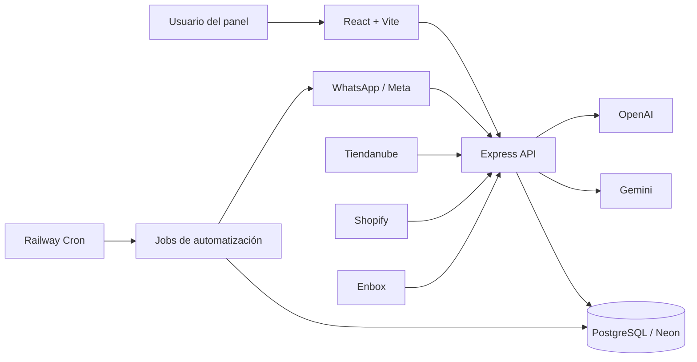
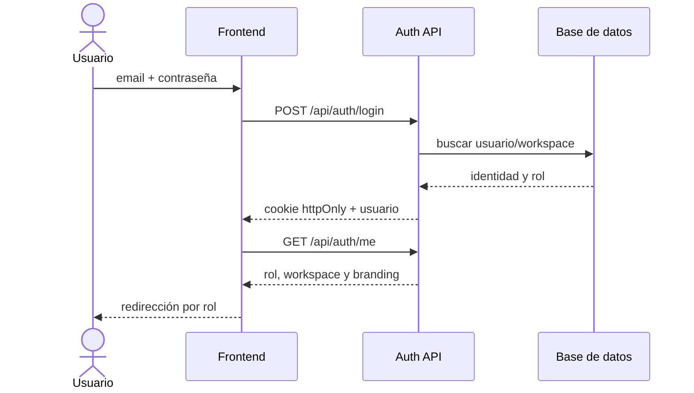
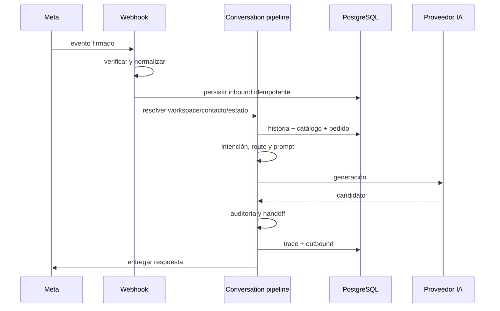
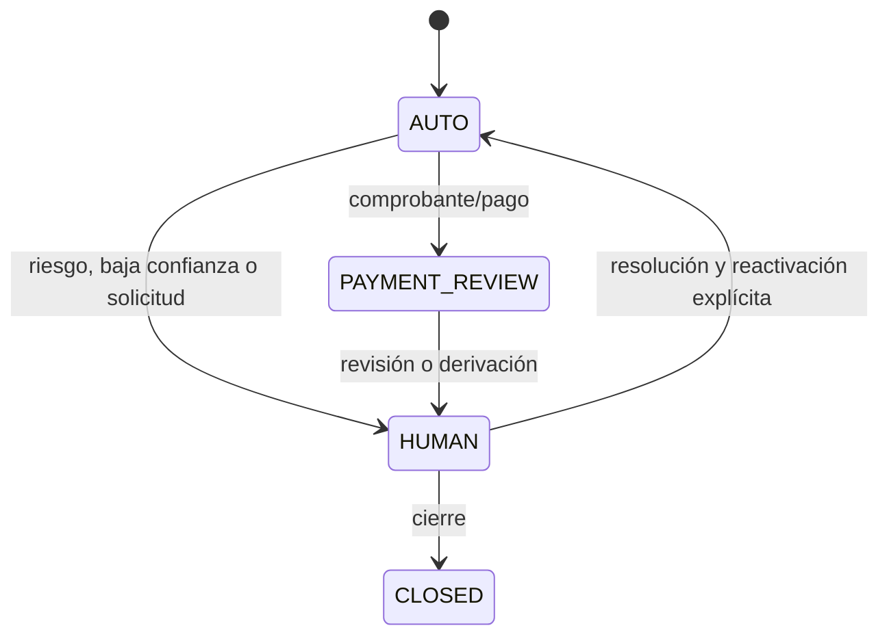
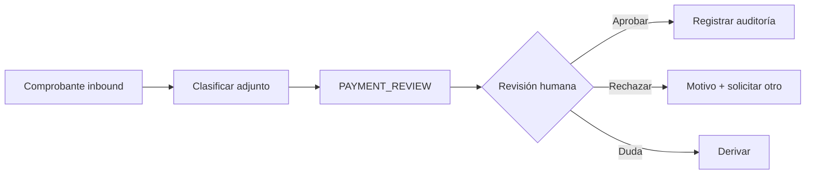
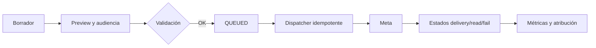
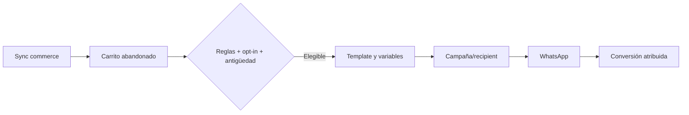
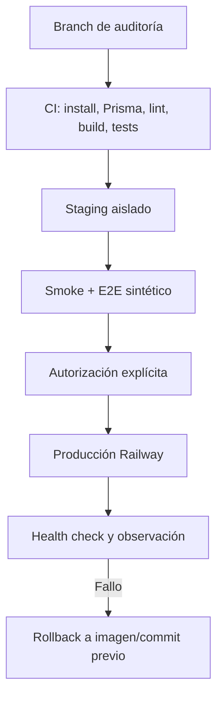

# Auditoría y mejora integral de BotLummine / BladeIA

Fecha de inicio: 2026-07-17  
Rama: `audit/general-improvements-20260717`  
Estado: en progreso; producción permanece en modo solo lectura.

## 1. Resumen ejecutivo

La aplicación tiene una base funcional amplia. La primera iteración cerró los P0 de build incompleto, falso verde E2E, doble compilación de prompt, fallback de proveedores y arranque local accidental contra una base remota. También corrigió selección, borradores y doble envío del Inbox, una fuga global de CSS desde Catálogo y el composer inaccesible en móvil. El `.env` local continúa apuntando a producción; el guard implementado bloquea el arranque local y no se ejecutaron seeds, migraciones ni pruebas con conexión.

## 2. Estado del repositorio local

- Ruta: `D:\01_Proyectos\Proyectos\Plataforma multi marca\BladeIA`.
- Base: `main` y `origin/main` en `c22684f`.
- Rama de trabajo: `audit/general-improvements-20260717`.
- Node local: 22.20.0. npm: 10.9.3.
- Gestor: npm; existen lockfiles en raíz, backend y frontend.
- Cambios previos preservados: ocho archivos versionados (412 inserciones, 36 eliminaciones) y assets/documentos de Instagram sin seguimiento.
- El `.env` de backend coincide con la `DATABASE_URL` de producción. Se considera únicamente apto para observación y no para ejecución local.

## 3. Estado de Railway

- Proyecto: `BladeIA`.
- Producción web: servicio `BladeIA`, commit `c22684f`, rama `main`, `SUCCESS/RUNNING`, Node 22.23.1, runtime V2, una réplica en `us-east4`, health check `/api/health` y HTTP 200 (~481 ms en la muestra inicial).
- Producción cron: servicio `BotLummine`, schedule `0 * * * *`, comando `npm run jobs:campaign-dispatch`. No hubo logs en las últimas 24 horas y no se observó `DATABASE_URL` entre sus variables propias.
- Staging: servicio `BladeIA`, commit `fef6232` del 2026-04-08, sin health check configurado, HTTP 200 (~664 ms). Usa otro host Neon.
- Logs producción: 121 líneas recientes, sin errores/timeouts/reinicios detectados; 47 requests HTTP en 24 h, sin 4xx/5xx ni requests >1 s en la muestra.
- Logs staging: errores recurrentes del campaign dispatcher (18 menciones de error, 15 de Prisma y 9 de timeout en 300 líneas).
- No se expusieron valores secretos ni se realizó ninguna mutación.

## 4. Diferencias local versus desplegado

- Código base local y producción web coinciden en `c22684f`; el working tree local contiene trabajo no publicado.
- Staging está varios meses atrasado y no es representativo del código actual.
- Producción web tiene root directory `/backend`; el cron usa la raíz del repositorio.
- Local usa Node 22.20.0; producción 22.23.1; staging 22.22.2.
- Staging conserva variables legacy y específicas de marca; producción utiliza la configuración moderna por workspace.

## 5. Arquitectura

Frontend React 18, Vite 8, React Router, React Query, Radix y Tailwind 4. Backend Express 5, Prisma 6.19.3 y PostgreSQL. Integraciones: Meta/WhatsApp, Tiendanube, Shopify, Enbox, Gemini, OpenAI y Sentry. Los módulos más grandes superan 1.600 líneas y concentran fetching, estado y presentación o autorización, queries y serialización.

## 6. Flujo de la aplicación

### Autenticación

### Mensaje inbound y respuesta automática

### Handoff humano

### Revisión de pagos

### Campaña

### Recuperación de carrito

### Deployment local y Railway

## 7. Problemas detectados

### FIND-P0-001

- Título: build raíz incompleto
- Área: CI/CD
- Ambiente: local/Railway
- Severidad: High
- Evidencia: `npm run build` solo ejecuta `prisma generate`.
- Impacto: un PR puede pasar sin compilar frontend ni revisar backend.
- Causa: script raíz reducido a una tarea de generación.
- Solución: comando de verificación reproducible para ambos paquetes.
- Estado: resuelto en `cc54042`; el build raíz valida backend y frontend.
- Archivos: `package.json`, workflow de CI.
- Pruebas: baseline confirmó falso positivo.
- Riesgo de deployment: bajo.

### FIND-P0-002

- Título: E2E con falso verde
- Área: QA
- Ambiente: local/CI
- Severidad: High
- Evidencia: `/whatsapp-menu` agotó 15 s, pero el único test terminó `1 passed`.
- Impacto: regresiones de pantallas críticas no bloquean cambios.
- Causa: el test captura excepciones por ruta y no afirma que el reporte esté libre de errores.
- Solución: smoke E2E determinista y aserción de cero errores.
- Estado: resuelto en `cc54042`; el test ahora falla si alguna ruta falla.
- Archivos: `frontend/tests/performance/load-times.spec.js` y nueva suite smoke.
- Pruebas: ejecución de 32,8 s con error registrado y exit code 0.
- Riesgo de deployment: bajo.

### FIND-P0-003

- Título: prompt compilado dos veces por turno
- Área: agente IA
- Ambiente: todos
- Severidad: High
- Evidencia: `chat.service.js` y `conversation-turn.service.js` llaman `buildPrompt`, luego `runAssistantReply` lo vuelve a llamar.
- Impacto: divergencia de trazas, costo de CPU, hashes no canónicos y mayor riesgo de inconsistencias.
- Causa: contrato de generación recibe contexto crudo y no el prompt compilado.
- Solución: compiler canónico y proveedor que reciba un artefacto compilado.
- Estado: resuelto en `d9b31fc`; existe un artefacto canónico versionado y hasheado.
- Archivos: servicios de IA y conversación.
- Pruebas: unitarias con contador de compilación y metadata.
- Riesgo de deployment: medio.

### FIND-P0-004

- Título: fallback de proveedor interrumpido
- Área: agente IA
- Ambiente: todos
- Severidad: High
- Evidencia: un error Gemini no reintentable ejecuta `break`, aunque OpenAI esté en la cadena.
- Impacto: handoff/fallback evitable y menor disponibilidad.
- Causa: retry y provider fallback comparten una clasificación binaria.
- Solución: taxonomía explícita y decisión separada de retry/fallback/handoff.
- Estado: resuelto en `d9b31fc`; retry y fallback usan taxonomía explícita.
- Archivos: `backend/src/services/ai/*`.
- Pruebas: unitarias por clase de error.
- Riesgo de deployment: medio.

### FIND-P0-005

- Título: `.env` local conectado a producción
- Área: seguridad operativa
- Ambiente: local/producción
- Severidad: Critical
- Evidencia: igualdad exacta contra la variable Railway, verificada sin imprimir el valor.
- Impacto: un seed, test o servidor local puede leer/escribir datos reales.
- Causa: ausencia de separación local por defecto.
- Solución: guard de entorno y base local descartable; nunca versionar el secreto.
- Estado: resuelto preventivamente en `744341b`; el arranque local remoto falla antes de abrir puerto o consultar la base.
- Archivos: documentación y scripts seguros futuros.
- Pruebas: comparación de URL redaccionada.
- Riesgo de deployment: ninguno para la mitigación documental.

### FIND-P1-006

- Título: CSS de Catálogo altera el shell de otras rutas
- Área: frontend/responsive
- Ambiente: local/todos
- Severidad: High
- Evidencia: al precargar Catálogo, `CatalogPage.css` inyectaba `.admin-shell { grid-template-columns: 280px 1fr }`; en 768 px sidebar y main quedaban en 280 px.
- Impacto: Inbox móvil inutilizable, contenido cortado y navegación fuera de contexto.
- Causa: estilos de layout global dentro del CSS de una feature lazy.
- Solución: eliminar los selectores globales del feature y proteger el shell móvil con ancho verificable.
- Estado: resuelto.
- Archivos: `CatalogPage.css`, `DashboardLayout.css`, `critical-flow.spec.js`.
- Pruebas: sidebar/main ocupan el ancho disponible y no existe overflow a 768 y 390 px.
- Riesgo de deployment: bajo.

### FIND-P1-007

- Título: composer del Inbox fuera del viewport móvil
- Área: Inbox/UI
- Ambiente: local/todos
- Severidad: High
- Evidencia: a 390x844 el textarea comenzaba en y=879; el contenedor imponía 726 px aunque sólo había 597 px disponibles.
- Impacto: el agente humano no podía responder sin un scroll interno no visible.
- Causa: resta rígida `100dvh - 118px` incompatible con la altura dinámica de navegación.
- Solución: dimensionar el chat activo desde su contenedor real y mantener el scroll en mensajes.
- Estado: resuelto.
- Archivos: `InboxPage.css`, `critical-flow.spec.js`.
- Pruebas: composer dentro del viewport a 390x844 y captura real validada.
- Riesgo de deployment: bajo.

### FIND-P1-008

- Título: trazas de IA legacy contienen payloads amplios y carecen de esquema canónico
- Área: IA/observabilidad
- Ambiente: todos
- Severidad: High
- Evidencia: la traza legacy incluye prompt, respuesta y objetos de contexto, pero no garantiza `traceId`, latencia, tokens ni límites de tamaño.
- Impacto: menor correlación operativa y riesgo de registrar contenido sensible o payloads excesivos.
- Causa: la traza evolucionó como objeto de depuración del AI Lab.
- Solución: traza canónica separada, acotada y sin contenidos, emitida una vez al finalizar cada inbound.
- Estado: resuelto para `processInboundMessage`; persiste la migración de consumidores legacy.
- Archivos: `turn-trace.js`, `chat.service.js`, `ai-turn-trace.test.js`.
- Pruebas: 2 casos verifican límites, hash, normalización y ausencia de prompt/mensaje.
- Riesgo de deployment: bajo; sólo agrega metadata/log estructurado.

### FIND-P0-009

- Título: respuestas de proveedor sin schema interno validado
- Área: agente IA
- Ambiente: todos
- Severidad: High
- Evidencia: los proveedores devolvían texto libre; una respuesta vacía podía atravesar la cadena sin contrato estructurado.
- Impacto: handoff, intención, hechos usados y flags no tenían un contrato común previo al delivery.
- Causa: adaptación directa de `text` desde cada SDK.
- Solución: schema canónico backward-compatible, normalización de proveedores y revalidación después de la auditoría de respuesta.
- Estado: resuelto.
- Archivos: `assistant-output.js`, `index.js`, ambos servicios de conversación y tests.
- Pruebas: salida legacy normalizada, rechazo de vacío/handoff incompleto y fallback ante `INVALID_OUTPUT`.
- Riesgo de deployment: medio-bajo; conserva `text` y agrega `output`.

### FIND-P0-010

- Título: reproceso inbound podía adoptar el workspace del mensaje buscado sólo por ID
- Área: seguridad/multitenancy
- Ambiente: todos
- Severidad: Critical
- Evidencia: `existingInboundMessageId` usaba `message.findUnique({ id })` y luego asignaba `resolvedWorkspaceId = inboundMessage.workspaceId`.
- Impacto: un ID incorrecto en el contrato interno podía cruzar el límite de tenant durante el reproceso.
- Causa: el workspace se trataba como dato recuperado y no como frontera inmutable de la operación.
- Solución: lookup obligatorio por `id + workspaceId + direction=INBOUND`; nunca reemplazar el workspace esperado.
- Estado: resuelto.
- Archivos: `workspace-scope.js`, `workspace-scope.test.mjs`, `chat.service.js`.
- Pruebas: rechazo de scopes incompletos y aserción exacta del filtro Prisma.
- Riesgo de deployment: bajo; los reprocesos válidos ya disponen de workspace.

### FIND-P0-011

- Título: vulnerabilidades high en dependencias productivas backend
- Área: seguridad/DevOps
- Ambiente: local/todos
- Severidad: High
- Evidencia: npm audit inicial reportó 11 vulnerabilidades (3 high), incluyendo CRLF injection, DoS de uploads y DoS/memory disclosure en WebSocket.
- Impacto: superficie evitable en uploads, multipart y dependencias del proveedor OpenAI.
- Causa: lockfile con versiones anteriores a los parches disponibles.
- Solución: upgrades compatibles y audit high bloqueante en CI.
- Estado: resuelto backend; frontend conserva 2 high pendientes para no pisar manifests del usuario.
- Archivos: `backend/package.json`, lockfile y workflow.
- Pruebas: `npm audit --omit=dev --audit-level=high` devuelve 0 vulnerabilidades; build y unitarias verdes.
- Riesgo de deployment: medio; revisar smoke de uploads/Sentry en staging.

### FIND-P1-012

- Título: menú móvil sin gestión de foco y label de contraseña contaminado
- Área: accesibilidad/frontend
- Ambiente: todos
- Severidad: High
- Evidencia: el overlay no enfocaba contenido ni respondía a Escape; el botón “Mostrar” estaba dentro del `<label>` y pasaba a formar parte del nombre del input.
- Impacto: navegación confusa o bloqueante para teclado y lectores de pantalla.
- Causa: estado visual/ARIA sin ciclo de foco y label envolviendo un control interactivo.
- Solución: diálogo modal con foco inicial, trap, Escape/restauración; labels por `htmlFor/id` y focus ring visible.
- Estado: resuelto.
- Archivos: `LoginPage.jsx`, `LoginPage.css`, prueba Playwright de teclado.
- Pruebas: 2/2 escenarios críticos de accesibilidad.
- Riesgo de deployment: bajo.

### FIND-P0-013

- Título: envío outbound permitía buscar conversaciones sin scope de workspace
- Área: seguridad/multitenancy
- Ambiente: todos
- Severidad: Critical
- Evidencia: `sendAndPersistOutbound` hacía `conversation.findUnique({ id })` cuando el caller omitía `workspaceId`; nueve llamadas internas no explicitaban el tenant.
- Impacto: un caller interno nuevo o manipulado podía resolver una conversación de otro workspace y usar su configuración/canal de delivery.
- Causa: el scope era opcional en el contrato del servicio compartido.
- Solución: `workspaceId` obligatorio, lookup canónico por `id + workspaceId` y propagación explícita por todos los callers.
- Estado: resuelto.
- Archivos: `workspace-scope.js`, `outbound-message.service.js`, AI Lab, chat, menú y prueba negativa.
- Pruebas: query exacto cubierto; 30/30 unitarias y build raíz verdes.
- Riesgo de deployment: bajo; los flujos válidos ya conocen el workspace de la conversación.

### FIND-P0-014

- Título: webhooks de plantillas descartaban la frontera WABA del sobre
- Área: seguridad/multitenancy/WhatsApp
- Ambiente: todos
- Severidad: High
- Evidencia: `processTemplateWebhook` omitía `entry.id`; si `value` no incluía `waba_id`, los cuatro handlers buscaban sólo por `metaTemplateId`.
- Impacto: una actualización de plantilla podía resolverse sin delimitar la cuenta de WhatsApp Business asociada al workspace.
- Causa: el sobre y el payload interno se procesaban por separado y el scope externo era opcional.
- Solución: propagar `entry.id`, exigir `metaTemplateId + wabaId` y rechazar scopes ausentes o inconsistentes.
- Estado: resuelto.
- Archivos: `webhook.controller.js`, `whatsapp-template.service.js`, `workspace-scope.js` y prueba negativa.
- Pruebas: 31/31 unitarias, 136 archivos con sintaxis válida y build raíz verde.
- Riesgo de deployment: bajo; los webhooks válidos de Meta incluyen el WABA en `entry.id`.

### FIND-P0-015

- Título: analytics eliminaba el scope cuando no había workspaces accesibles
- Área: seguridad/multitenancy/analytics
- Ambiente: todos
- Severidad: High
- Evidencia: ocho agregaciones reemplazaban el filtro por `undefined` o sólo por fecha cuando `workspaceIds` estaba vacío.
- Impacto: el endpoint consultaba datos de todos los tenants aunque el mapeo posterior descartara las filas; aumentaba costo y dejaba una futura fuga a un cambio de serialización.
- Causa: se interpretó una lista vacía como ausencia de filtro en vez de ausencia de acceso.
- Solución: constructor canónico que siempre produce `workspaceId: { in: [...] }`; una lista vacía permanece restrictiva.
- Estado: resuelto.
- Archivos: `admin.controller.js`, `workspace-scope.js` y prueba negativa.
- Pruebas: 32/32 unitarias y build backend con 136 archivos válidos.
- Riesgo de deployment: bajo; no cambia resultados válidos y evita lecturas innecesarias.

### FIND-P0-016

- Título: adjuntos autenticados permitían caché pública compartida
- Área: seguridad/archivos
- Ambiente: todos
- Severidad: High
- Evidencia: `/api/media/inbox/:fileName` requiere autenticación y scope, pero respondía `Cache-Control: public, max-age=31536000, immutable`.
- Impacto: proxies o caches compartidos podían conservar documentos, imágenes o comprobantes privados durante un año fuera del control de sesión.
- Causa: se reutilizó una política apropiada para assets públicos en contenido sensible del Inbox.
- Solución: política canónica `private, no-store`, compatibilidad anti-cache y `X-Content-Type-Options: nosniff`.
- Estado: resuelto.
- Archivos: `media.controller.js`, `http-cache-policy.js` y prueba unitaria.
- Pruebas: 34/34 unitarias y build backend con 138 archivos válidos.
- Riesgo de deployment: bajo; aumenta requests de adjuntos a cambio de evitar persistencia no controlada.

### FIND-P0-017

- Título: cooldown automático operaba estados y mensajes sólo por conversationId
- Área: seguridad/multitenancy/agente IA
- Ambiente: todos
- Severidad: Critical
- Evidencia: carga, claim, unlock y limpieza de `pendingAutoReply` ignoraban el `workspaceId` recibido; el mensaje pendiente tampoco lo filtraba y el reproceso prefería el argumento sobre el tenant persistido.
- Impacto: una asociación interna incorrecta podía reclamar o reprocesar estado de otra conversación/tenant y disparar una respuesta con configuración equivocada.
- Causa: `ConversationState` no posee `workspaceId` directo y el código no aplicaba filtro relacional mediante `conversation.workspaceId`.
- Solución: scope canónico relacional, workspace obligatorio al programar/procesar y filtro del mensaje inbound por el mismo tenant.
- Estado: resuelto.
- Archivos: `chat.service.js`, `workspace-scope.js` y prueba negativa.
- Pruebas: 35/35 unitarias, tipo Prisma verificado y build backend verde.
- Riesgo de deployment: bajo; todos los callers actuales ya suministran el workspace correcto.

### FIND-P0-018

- Título: selección de conexión comercial primaria aceptaba un ID global
- Área: seguridad/multitenancy/comercio
- Ambiente: todos
- Severidad: Critical
- Evidencia: `markPrimaryCommerceConnection` desactivaba conexiones del workspace solicitado y luego ejecutaba `update({ id: connectionId })` sin comprobar pertenencia.
- Impacto: un ID incorrecto podía modificar otro tenant y además dejar al workspace legítimo sin conexión primaria.
- Causa: el caller era considerado confiable y la precondición no formaba parte de la transacción.
- Solución: lookup canónico por `id + workspaceId` al inicio de la transacción; ante ausencia se aborta antes de cualquier escritura.
- Estado: resuelto.
- Archivos: `active-commerce.service.js`, `workspace-scope.js` y prueba negativa genérica.
- Pruebas: 36/36 unitarias y build backend con 138 archivos válidos.
- Riesgo de deployment: bajo; callers válidos usan conexiones del workspace esperado.

### FIND-P0-019

- Título: helpers compartidos de menú y handoff mutaban conversaciones por ID global
- Área: seguridad/multitenancy/conversación
- Ambiente: todos
- Severidad: Critical
- Evidencia: `patchConversationState`, `syncHumanHandoff` y `enableAutomaticConversation` no recibían workspace y usaban `upsert/update({ id })`.
- Impacto: un caller interno con ID incorrecto podía alterar queue, estado de IA o memoria de otra conversación.
- Causa: los helpers nacieron como utilidades internas antes de consolidar el límite multitenant.
- Solución: workspace obligatorio, validación transaccional de pertenencia y propagación en menú, chat y AI Lab.
- Estado: resuelto.
- Archivos: `menu-flow.service.js`, `chat.service.js`, `ai-lab.service.js` y helper de scope.
- Pruebas: 36/36 unitarias, todos los callers inspeccionados y build backend verde.
- Riesgo de deployment: medio-bajo; agrega consultas de validación y todos los callers activos suministran workspace.

### FIND-P1-020

- Título: Inbox mostraba estados vacíos durante errores de lista e historial
- Área: UI/UX/Inbox/pagos
- Ambiente: todos
- Severidad: High
- Evidencia: al fallar `inboxQuery` o `conversationQuery`, las condiciones de empty seguían activas y el composer permanecía habilitado con historial no disponible.
- Impacto: el operador interpretaba un fallo como ausencia de trabajo y podía intentar responder sin contexto.
- Causa: loading y empty estaban separados, pero error no participaba en las condiciones de render/disabled.
- Solución: errores explícitos con reintento, empty mutuamente excluyente, composer bloqueado y borrador preservado.
- Estado: resuelto.
- Archivos: `InboxPage.jsx/css`, `OperationsPage.jsx`, `InternalPage.jsx` y Playwright.
- Pruebas: 8/8 E2E; el caso agota retries automáticos y recupera lista/historial manualmente.
- Riesgo de deployment: bajo.

### FIND-P1-021

- Título: Administración confundía fallas de carga con resultados vacíos
- Área: UI/UX/Administración/Analytics
- Ambiente: todos
- Severidad: High
- Evidencia: la lista de marcas mostraba el empty durante su request y Analytics renderizaba métricas en cero junto con un error global cuando fallaba su endpoint.
- Impacto: un administrador podía interpretar una indisponibilidad como ausencia de marcas o actividad y no tenía una recuperación contextual.
- Causa: lista, detalle, acciones y Analytics compartían estados parciales; el error de consulta terminaba en el banner genérico.
- Solución: estados loading/error/empty/data mutuamente excluyentes para marcas y Analytics, errores locales anunciados y reintento de la consulta exacta.
- Estado: resuelto.
- Archivos: `AdminPage.jsx`, `tests/admin/async-states.spec.js` y capturas deterministas.
- Pruebas: 2/2 E2E específicos y 10/10 Playwright completo; recuperación de ambas APIs verificada.
- Riesgo de deployment: bajo; no cambia endpoints ni persistencia.

### FIND-P1-022

- Título: filtros de Clientes no tenían nombres accesibles ni error de datos exclusivo
- Área: UI/UX/Accesibilidad/Clientes
- Ambiente: todos
- Severidad: High
- Evidencia: los labels visuales no estaban asociados a inputs/selects, el selector no exponía `aria-expanded`, la página activa sólo se distinguía por color y un fallo de `/dashboard/customers` mostraba simultáneamente el empty.
- Impacto: navegación deficiente con lector de pantalla/teclado y riesgo de interpretar una indisponibilidad como ausencia de compras.
- Causa: controles construidos como grupos visuales sin contratos semánticos y error copiado a un banner ajeno al estado de la lista.
- Solución: formulario semántico operable con Enter, labels asociados, selector y paginación anunciados, progreso/errores con roles, targets táctiles medidos y estado de carga/error/empty/data exclusivo con retry.
- Estado: resuelto.
- Archivos: `CustomersPage.jsx/css`, `tests/accessibility/customers-keyboard.spec.js` y captura mobile.
- Pruebas: 2/2 E2E específicos y 12/12 Playwright completo; sin overflow a 390 px y target efectivo >=44 px.
- Riesgo de deployment: bajo; cambios de presentación y refetch únicamente.

### FIND-P1-023

- Título: Catálogo y AI Lab carecían de contratos accesibles en búsqueda y conversación
- Área: UI/UX/Accesibilidad/Catálogo/AI Lab
- Ambiente: todos
- Severidad: Medium
- Evidencia: la búsqueda de Catálogo dependía del placeholder, su error no ofrecía retry; el textarea de AI Lab no tenía nombre accesible y el historial no exponía semántica de conversación viva.
- Impacto: usuarios de teclado/lector no podían identificar controles o recibir nuevos turnos con claridad; los fallos de catálogo exigían recargar toda la vista.
- Causa: componentes visuales implementados sin label/log y estados de recuperación locales.
- Solución: label visible, paginación semántica y retry en Catálogo; `role=log`, `aria-busy/live`, composer etiquetado, retry de workspaces y respeto de reduced-motion en AI Lab.
- Estado: resuelto.
- Archivos: `CatalogPage.jsx/css`, `AiLabPage.jsx/css`, E2E accesible y capturas mobile.
- Pruebas: 2/2 E2E específicos y 14/14 Playwright completo; AI Lab usa pipeline mock sin delivery externo.
- Riesgo de deployment: bajo; no modifica contratos ni proveedores.

### FIND-P1-024

- Título: la traza canónica IA sólo existía en logs sin retención verificable
- Área: IA/Observabilidad/Backend
- Ambiente: todos
- Severidad: High
- Evidencia: `finalizeInboundResult` emitía `ai.turn.completed`, pero no existía almacenamiento consultable ni fecha de expiración; `AiLabRun.tracePayload` no es una traza productiva y contiene datos de laboratorio.
- Impacto: no era posible correlacionar turnos históricos ni aplicar una política de minimización/retención comprobable.
- Causa: la primera iteración priorizó redacción y logging antes de introducir un cambio de schema.
- Solución: tabla aditiva `AiTurnTrace` sólo con metadata canónica, scope de workspace/conversación, expiración configurable, persistencia tolerante a migración gradual y job de poda dry-run por defecto.
- Estado: implementado y validado localmente; migración preparada, no aplicada.
- Archivos: schema/migración Prisma, `turn-trace-store.js`, integración en chat, script de poda y pruebas.
- Pruebas: 39/39 unitarias, 140 archivos con sintaxis válida, Prisma validate/generate y SQL generado inspeccionado.
- Riesgo de deployment: medio; requiere migración aditiva previa y configurar retención/cron en staging antes de producción.

### FIND-P1-025

- Título: una decoración pública cargaba Three.js completo y el shell precargaba todas las rutas privadas
- Área: Frontend/Rendimiento
- Ambiente: local
- Severidad: High
- Evidencia: el build generaba `vendor-three` de 505,81 kB minificado y el reporte de Operaciones descargaba también chunks/CSS de Inbox y Campañas durante el idle inicial.
- Impacto: mayor transferencia, inicialización WebGL continua y competencia de red con la pantalla activa, especialmente costosa en equipos móviles.
- Causa: la grilla decorativa usaba Three.js para puntos simples y `scheduleIdleInternalPrefetch` recorría todas las rutas frecuentes con módulo y datos.
- Solución: superficie CSS decorativa con reduced motion y prefetch idle limitado a un único módulo probable; hover, foco y touch conservan el prefetch explícito de módulo y datos.
- Estado: resuelto y medido localmente.
- Archivos: `dotted-surface.tsx/css`, `internalRoutePrefetch.js`, `DashboardLayout.jsx`.
- Pruebas: build sin `vendor-three`, 3/3 pruebas públicas y performance 10/10 rutas; captura landing 1440x960 inspeccionada.
- Riesgo de deployment: bajo; el fondo es decorativo y el prefetch de interacción sigue activo.

### FIND-P0-026

- Título: CI no ejecutaba el typecheck existente ni validaba el comando raíz como contrato único
- Área: CI/CD/DX
- Ambiente: CI
- Severidad: High
- Evidencia: `tsconfig` y TypeScript estaban instalados, pero `quality.yml` compilaba productos por separado y omitía `tsc`; performance corría sin presupuesto bloqueante y los diagnósticos no se conservaban al fallar.
- Impacto: una regresión de tipos o del orquestador raíz podía llegar a revisión y los fallos E2E perdían evidencia útil.
- Causa: la workflow creció por pasos aislados sin consolidar el contrato de producto.
- Solución: `npx tsc -b`, `npm run build` raíz, `PERF_STRICT=1` y upload de report/trace/screenshot sólo ante fallo por siete días.
- Estado: implementado; pendiente observar la primera ejecución remota del PR.
- Archivos: `.github/workflows/quality.yml`.
- Pruebas: typecheck local 0 errores en 3,8 s, build raíz verde y 14/14 Playwright; sintaxis YAML revisada por diff, action runner pendiente.
- Riesgo de deployment: bajo; sólo afecta validación de PR y no publica artefactos de producción.

### FIND-P0-027

- Título: las programaciones de campaña aceptaban un workspace implícito y mutaban sólo por ID
- Área: Backend/Seguridad/Multitenancy
- Ambiente: todos
- Severidad: Critical
- Evidencia: las seis funciones públicas de `campaign-schedule.service.js` resolvían un workspace ausente como `DEFAULT_WORKSPACE_ID`; update/delete y el dispatcher reusaban luego sólo el ID global. Recuperación manual de carrito repetía la mutación global para carrito y conversación.
- Impacto: un caller interno incompleto podía operar silenciosamente sobre el tenant por defecto; una regresión futura perdía la frontera de workspace entre lectura y escritura.
- Causa: compatibilidad legacy con tenant único y confianza en IDs obtenidos previamente.
- Solución: workspace explícito obligatorio, helper común que falla cerrado y `id + workspaceId` en update/delete/claim del scheduler y recuperación de carrito.
- Estado: resuelto localmente; no se ejecutaron campañas ni mensajes externos.
- Archivos: `campaign-schedule.service.js`, `abandoned-cart.controller.js`, `workspace-scope.js` y prueba negativa.
- Pruebas: 40/40 unitarias, 140 archivos con sintaxis válida; el caso negativo rechaza workspace vacío y normaliza sólo scope explícito.
- Riesgo de deployment: bajo/medio; los controllers actuales ya envían workspace, pero jobs/callers externos no inventariados deben validarse en staging.

### FIND-P0-028

- Título: la edición de usuarios consultaba y mutaba globalmente antes de aplicar la autorización
- Área: Backend/Administración/Multitenancy
- Ambiente: todos
- Severidad: High
- Evidencia: `PATCH /api/admin/users/:userId` hacía `findUnique({ id })`, luego autorizaba según el workspace del registro y finalmente `update({ id })`.
- Impacto: un ADMIN podía distinguir un ID existente de otro tenant por la diferencia 403/404; una regresión entre lectura y escritura perdía la frontera de marca.
- Causa: la autorización estaba implementada como comprobación posterior al lookup global.
- Solución: ADMIN usa `id + workspaceId` desde la primera query hasta la mutación y recibe 404 fuera de su scope; sólo PLATFORM_ADMIN conserva lookup global explícito.
- Estado: resuelto localmente.
- Archivos: `admin.controller.js`, `workspace-scope.js` y prueba negativa.
- Pruebas: 41/41 unitarias, 140 archivos con sintaxis válida; se cubren scope obligatorio, aislamiento de ADMIN y excepción explícita de plataforma.
- Riesgo de deployment: bajo; no cambia el caso autorizado, sólo falla cerrado ante IDs ajenos.

### FIND-P0-029

- Título: tareas de mantenimiento perdían el workspace dentro de transacciones destructivas
- Área: Backend/Inbox/Comercio/Multitenancy
- Ambiente: todos
- Severidad: High
- Evidencia: deduplicación movía/borraba mensajes, estados, conversaciones y contactos sólo por ID; selección primaria de comercio aceptaba tenant implícito y su update final usaba sólo ID.
- Impacto: aunque los registros provenían de lecturas acotadas, una regresión o dato inconsistente podía ampliar una operación destructiva más allá del workspace original.
- Causa: confianza en unicidad global y scope no propagado dentro de la transacción.
- Solución: filtros de workspace en movimientos, deletes, updates y estados relacionados; conexión comercial exige scope explícito y lo conserva en el update final.
- Estado: resuelto localmente; no se ejecutó deduplicación ni sincronización real.
- Archivos: `dashboard.controller.js`, `active-commerce.service.js`.
- Pruebas: 41/41 unitarias y 140 archivos con sintaxis válida; inventario de callers confirma workspace explícito.
- Riesgo de deployment: bajo; endurecimiento de filtros sin cambios de schema.

## 8. Auditoría UI/UX

- Inbox: selección desktop automática con URL; móvil conserva el flujo progresivo lista → chat; borrador por conversación; error y retry sin pérdida; bloqueo de doble envío.
- Responsive: corregidos shell contaminado por CSS lazy y composer fuera del viewport.
- Estados: Inbox/Comprobantes y Clientes separan carga, vacío, error y datos; Operaciones, Administración y Analytics ofrecen recuperación contextual. Queda pendiente extender el patrón a campañas, cuyos archivos tienen cambios locales concurrentes preservados.
- Evidencia: capturas deterministas en 1440x960, 1280x800, 768x1024 y 390x844 con datos sintéticos.
- Pendiente: recorrido visual completo de las vistas privadas restantes, teclado integral y axe.

## 9. Auditoría frontend

- Build exitoso en 894 ms en la validación final de esta iteración.
- `vendor-three`: eliminado del build (baseline 505,81 kB minificado) al reemplazar WebGL decorativo por CSS; la dependencia declarada queda para coordinar cuando los manifests concurrentes estén libres.
- CSS de campañas: 100,63 kB; CSS global principal: 140,17 kB; Clientes: 28,97 kB.
- `InboxPage.jsx`: ~1.680 líneas; `AdminPage.jsx`: ~1.965; `CampaignsFeaturePage.jsx`: ~1.774.
- El typecheck estricto existente ahora bloquea CI mediante `tsc -b`; sigue sin haber un lint reproducible configurado.
- Se añadieron tokens semánticos base, foco visible global y reducción de movimiento.
- Se detectó y eliminó un bloque legacy de estilos globales en `CatalogPage.css`.
- Auditoría frontend: 5 vulnerabilidades productivas reportadas (2 high en Vite/esbuild); no se modificaron manifests sucios del usuario.

## 10. Auditoría backend

- 140 archivos JS/MJS pasan el chequeo de sintaxis.
- 41 pruebas unitarias pasan, incluidas seguridad de DB, compiler/fallback IA, persistencia/retención de trazas, aislamiento de workspace/WABA/analytics/estado/comercio/schedules/usuarios y caché privada de adjuntos.
- Controllers de dashboard/admin rondan 1.900 líneas.
- Deben auditarse operaciones por ID sin filtro compuesto de workspace y callbacks legacy con defaults.

## 11. Auditoría del agente de IA

Pipeline reconstruido: webhook -> normalización -> persistencia -> workspace/contacto -> historia/estado -> intención/route -> catálogo/pedido/campaña -> prompt -> proveedor -> auditoría -> handoff -> persistencia/delivery. El prompt se compila una vez, con `promptVersion`, SHA-256 y `factsUsed`; los proveedores reciben el mismo artefacto y el fallback continúa según taxonomía. La respuesta se normaliza y valida contra el schema interno (`reply`, `needsHuman`, `handoffReason`, `detectedIntent`, `confidence`, `usedFacts`, `riskFlags`) y se revalida tras la auditoría antes del delivery. Cada salida de `processInboundMessage` emite una traza canónica acotada y, cuando existe inbound, prepara su persistencia sin prompt/mensaje con expiración (30 días por defecto, rango 1-365). AI Lab anuncia el historial como log y su E2E usa el pipeline simulado sin delivery. La activación de persistencia espera migración en staging; generación nativa estructurada del proveedor sigue pendiente.

## 12. Seguridad y multitenancy

El schema incluye `workspaceId` e índices relevantes. Se añadieron pruebas negativas: ADMIN y AGENT no pueden reemplazar el workspace mediante params, query, headers o body; PLATFORM_ADMIN sí puede seleccionar uno explícitamente. Reproceso/cooldown, outbound, menú, handoff y memoria de conversación usan scope explícito; los webhooks de plantillas exigen `metaTemplateId + wabaId` y analytics mantiene un filtro restrictivo incluso con cero workspaces. Schedules ya no aceptan el tenant por defecto y sus mutaciones/claims conservan `id + workspaceId`; recuperación manual de carrito, gestión de usuarios, deduplicación de Inbox y conexión comercial hacen lo mismo. Shopify/Tiendanube verifican HMAC/state y resuelven el tenant mediante tienda/canal; queda pendiente implementar, no sólo reconocer, los webhooks de privacidad Shopify. Persisten como backlog las queries de módulos concurrentemente modificados.

## 13. Railway y despliegues

Producción es solo lectura. Riesgos: cron sin evidencia de ejecución/variables operativas y staging obsoleto. El start productivo aplica migraciones automáticamente; debe revisarse el desacople hacia pre-deploy controlado.

## 14. Accesibilidad

Se incorporaron labels del composer/búsqueda y filtros de Clientes/Catálogo, estados `alert`/`status`, `role=log`, `aria-pressed`, `aria-expanded`, `aria-current`, foco visible y `prefers-reduced-motion`. Loading/error compartidos anuncian `aria-live`/`aria-busy`; el menú público móvil gestiona foco inicial, trap, Escape y restauración. Clientes permite operar filtros/selector con teclado y mantiene targets táctiles >=44 px a 390 px; AI Lab anuncia los nuevos turnos y evita scroll suave con reduced motion. Sigue pendiente la auditoría WCAG 2.2 AA completa y axe.

## 15. Rendimiento

Baseline mock: rutas internas críticas listas entre 212 y 474 ms; la landing pública osciló entre 1.598 y 3.989 ms y el build contenía `vendor-three` de 505,81 kB. Después: landing lista en 351-478 ms en corridas aisladas y 1.052 ms bajo la concurrencia de la suite completa; rutas internas entre 170 y 327 ms, sin chunk Three.js ni warning >500 kB. El idle de Operaciones ya no trae Campañas: sólo calienta el siguiente módulo probable; datos y demás rutas se preparan por interacción. La fuente remota y el carrusel de 131,47 kB siguen como oportunidades medidas.

## 16. Pruebas

| Comando | Resultado | Tiempo |
|---|---:|---:|
| `npm ci` backend | OK; 11 vulnerabilidades (3 high) | 10,1 s |
| `npm ci` frontend | OK; 5 vulnerabilidades (2 high) | 7,1 s |
| `prisma validate` | OK | 2,5 s |
| backend syntax | 140/140 | incluido en build |
| unit tests | 41/41 | 0,31 s |
| AI eval offline | 28/28 intención; 8 candidatos pendientes | 0,5 s |
| npm audit backend prod | 0 vulnerabilidades | 1,2 s |
| npm audit frontend prod | 5; 2 high pendientes | 2,2 s |
| frontend build | OK; sin chunks >500 kB | 0,94 s |
| frontend typecheck | OK; 0 errores | 3,8 s |
| root build | OK; backend + frontend | 10,3 s |
| Playwright Chromium | 14/14; 10 rutas de performance | 17,7 s |

Durante el refactor de prefetch, una primera corrida privada falló porque faltaba importar `getInternalRouteKey`; el error boundary lo expuso, se corrigió y la repetición aislada completó 10/10 rutas. No se ocultó ni relajó el test.

## 17. Cambios implementados

- Build raíz real, CI, syntax check, Prisma y E2E estricto.
- Compiler canónico de prompt, hash/version/facts y taxonomía/fallback de proveedores.
- Guard contra base remota en desarrollo y pruebas negativas de workspace.
- Inbox: selección/URL, borradores, error/retry, doble envío y flujo móvil.
- Tokens semánticos, foco visible, reduced motion y contención responsive.
- Eliminación de fuga CSS de Catálogo.
- Capturas deterministas públicas e Inbox con datos sintéticos.
- Traza canónica redactada por inbound, con límites y cobertura unitaria.
- Corpus sintético de 36 casos y runner offline bloqueante en CI.
- Schema interno validado antes de delivery y fallback por `INVALID_OUTPUT`.
- Scope inmutable `id + workspaceId` para reproceso de mensajes inbound.
- Dependencias backend parcheadas y audit high agregado a CI.
- Menú público móvil y formulario de login cubiertos con pruebas de teclado.
- Scope obligatorio de workspace en todo envío outbound.
- Scope WABA obligatorio en webhooks de plantillas de WhatsApp.
- Scope restrictivo en agregaciones de analytics, incluso con lista vacía.
- Adjuntos autenticados fuera de caches públicas o persistentes.
- Cooldown/reproceso automático acotado por la relación conversación-workspace.
- Selección de conexión comercial primaria validada dentro de la transacción.
- Helpers de menú, handoff y estado de conversación con workspace obligatorio.
- Errores y reintentos explícitos en lista/historial de Inbox y Operaciones.
- Estados de marcas y Analytics mutuamente excluyentes, con reintentos locales y evidencia visual.
- Clientes: formulario/labels semánticos, selector y paginación accesibles, targets mobile y error recuperable.
- Catálogo: búsqueda etiquetada, paginación y retry; AI Lab: historial anunciado, composer accesible y reduced motion.
- Persistencia redactada de trazas IA con expiración y poda segura, preparada mediante migración aditiva.
- Fondo público sin Three.js y prefetch privado acotado para evitar trabajo especulativo masivo.
- CI con typecheck, build raíz, presupuesto de performance y diagnósticos Playwright en fallos.
- Programaciones de campaña y recuperación de carrito sin fallback de tenant y con mutaciones acotadas por workspace.
- Edición de usuarios de marca con lookup/mutación dentro del workspace y acceso global exclusivo de plataforma.
- Deduplicación de Inbox y selección de comercio con scope propagado a toda la transacción.

## 18. Comparación antes/después

- Root build: de falso verde (sólo Prisma) a validación de ambos productos.
- Unitarias: de 7 casos localizados a 36 pruebas ejecutadas.
- E2E: de una suite que ocultaba fallos a 14 pruebas bloqueantes.
- Inbox 390 px: de sidebar/contenido de 280 px y composer fuera de pantalla a ancho completo, sin overflow y composer visible.
- Prompt: de dos compilaciones por turno a un artefacto determinista compartido.
- Bundle: de `vendor-three` 505,81 kB a ningún chunk Three.js; landing mock de 1.598-3.989 ms a 351-478 ms.

## 19. Capturas

Generadas en `frontend/audit-artifacts/screenshots/after/`: landing, precios, contacto y login en 1440x960/390x844; Inbox automático en 1440x960/1280x800; lista/chat en 768x1024/390x844; Clientes/selector, Catálogo y AI Lab en 390x844; revisión de pagos, errores de lista/historial, error de marcas y error de Analytics en 1440x960. Todas usan fixtures sintéticos. No se conserva una serie completa “before”; la evidencia previa móvil quedó registrada en métricas y hallazgos, limitación declarada para esta iteración.

## 20. Métricas

Baseline disponible en las secciones 3, 15 y 16. Evaluación offline de intención: 25/28 inicial y 28/28 después de corregir dos falsos negativos de handoff y un falso positivo de prompt injection. Ocho casos de candidato quedan pendientes de sandbox; no hay métricas confiables de costo/calidad generativa todavía.

## 21. Riesgos pendientes

- Auditoría exhaustiva de aislamiento multitenant por entidad aún incompleta.
- La persistencia/retención de trazas requiere migrar y programar la poda en staging; producción aún sólo registra logs.
- Sin lint ni axe reproducibles configurados; typecheck ya bloquea CI.
- Fuente web remota, imágenes públicas pesadas y carrusel lazy de 131,47 kB todavía condicionan la carga pública.
- Frontend mantiene 2 vulnerabilidades high hasta coordinar sus manifests locales.
- Staging no representativo.
- Cron productivo sin evidencia operativa.
- Webhooks de privacidad Shopify se reconocen pero todavía no ejecutan exportación/redacción de datos.

## 22. Backlog

P0: completar auditoría multitenant, activar/validar retención de trazas en staging, lint reproducible y security audit frontend.

P1: inbox, pagos, operaciones, campañas/carritos, estados compartidos y accesibilidad crítica.

P2: plantillas, catálogo, clientes, AI Lab, imágenes/fuentes públicas y responsive amplio.

P3: analytics, personalización y detalles cosméticos.

## 23. Ejecución local

Hasta preparar una base descartable, sólo ejecutar comandos sin conexión. No usar `backend/.env` para seed, migrate o tests integrados. El guard bloquea el arranque local remoto salvo override explícito. Comandos comprobados: instalación, `npm run build`, `npm run prisma:validate`, `npm run test:unit` y Playwright con API mockeada.

## 24. Validación en staging

No apta todavía: staging debe actualizarse desde un commit revisado, confirmar base separada, desactivar delivery externo y usar fixtures sintéticos antes de pruebas mutantes.

## 25. Plan de deployment

1. CI verde y revisión del diff.
2. Aplicar en staging la migración aditiva `20260717170000_add_ai_turn_traces`; configurar por nombre `AI_TRACE_RETENTION_DAYS`, `AI_TRACE_PRUNE_BATCH_SIZE` y `AI_TRACE_PRUNE_MAX_BATCHES`, sin registrar valores secretos.
3. Desplegar a staging aislado.
4. Smoke de health/auth/inbox con datos sintéticos y delivery deshabilitado.
5. Autorización explícita.
6. Deploy productivo gradual, observar health/logs/latencia y errores.

## 26. Rollback

- Mantener commit e imagen Railway previos identificados.
- Cambios de aplicación compatibles hacia atrás y sin migración destructiva.
- Ante error: detener rollout, redeploy del commit previo y verificar `/api/health`.
- La nueva app tolera temporalmente la ausencia de `AiTurnTrace`; para rollback completo, volver primero al commit previo y luego, sólo si se decide eliminar metadata, ejecutar `DROP TABLE "AiTurnTrace"` en una ventana autorizada.
- Si una migración futura fuera necesaria, preparar rollback SQL probado sobre copia descartable; no usar `db push` ni `migrate reset`.
